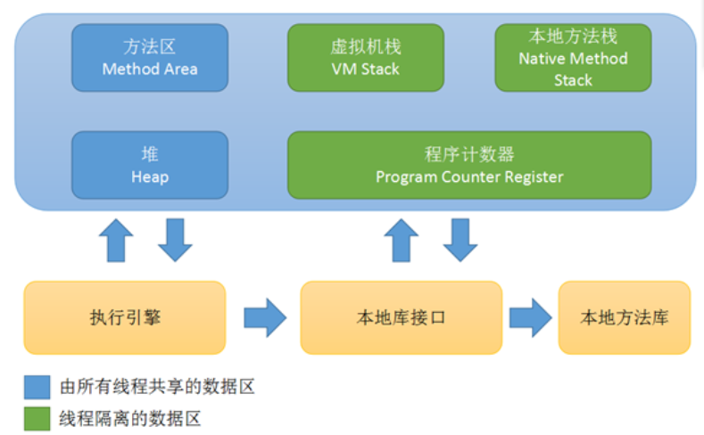

Java虚拟机在执行Java程序的过程中会把他所管理的内存划分为若干个不同的数据区域。根据《Java 虚拟机规范(Java SE 7版)》规定， Java虚拟机所管理的内存将会包括以下几个运行时数据区域，如图：

 

# 程序计数器

程序计数器(Program Counter Register)是一块较小的内存空间，它可以看作是当前线程所执行的字节码的行号指示器。在虚拟机的概念模型里(仅是概念模型，各种虚拟机可能会通过一些更高效的方式去实现)，字节码解释器工作时就是通过改变这个计数器的值来选取下一条需要执行的字节码指令，分支、循环、跳转、异常处理、县城回复等基础功能都需要依赖这个计数器来完成。

由于在任何一个确定的时刻，一个处理器都只会执行一条线程中的指令。因此，为了线程切换后能恢复到正确的执行位置，**每条线程都需要有一个独立的程序计数器，各条线程之间计数器互不影响，独立存储**，我们称这类内存区域为"线程私有"的内存。

# Java虚拟机栈

Java虚拟机栈(Java Virtual Machine Stacks)也是**线程私有的，它的生命周期与线程相同**。用于描述Java方法执行的内存模型：每个方法在执行的同时会创建一个栈帧(Stack Frame)用于存储局部变量表、操作数栈、动态链接、方法出口等信息。每个方法从调用直至执行完成的过程，就对应着一个栈帧在虚拟机栈中入栈到出栈的过程。其中局部变量表指的就是我们常说的“栈”。

局部变量表存放了**编译期可知的各种基本数据类型、对象引用(它不等同于对象本身，可能是一个指向对象起始地址的引用指针，也可能是指向一个代表对象的句柄或其他与此对象相关的位置)和returnAddress类型(指向了一条字节码指令的地址)。**

在Java虚拟机规范中，对这个区域规定了两种异常状况：如果线程请求的栈深度大于虚拟机所允许的深度，将抛出StackOverflowError异常：如果虚拟机栈可以动态扩展(当前大部分虚拟机都可动态扩展，只不过也允许固定长度的虚拟机栈)，如果扩展时无法申请到足够的内存，就会抛出OutOfMemoryError异常

# 本地方法栈

本地方法栈(Native Method Stack)与虚拟机所发挥的作用非常相似，虚拟机栈为虚拟机执行Java方法服务，而本地方法栈则为虚拟机用到的Native方法(一个Native Method是这样一个java的方法：该方法的实现由非java语言实现，比如C)服务。

有的虚拟机会将本地方法栈和虚拟机栈合二为一。与虚拟机栈一样，本地方法栈区域也会抛出StackOverflowError和OutOfMemoryError异常。

# Java堆

Java堆(Java Heap)是被所有线程共享的一块内存区域，在虚拟机启动时创建。此内存区域的唯一目的就是存放对象实例，几乎所有的对象实例都在这里分配内存。**所有的对象实例以及数组都要在堆上分配。**

Java堆是垃圾收集器管理的主要区域，也被称为"GC堆"。由于现在收集器基本都采用分代收集算法，所以Java堆中还可以细分为：新生代和老年代。

# 方法区

方法区(Method Area)和Java堆一样，是各个线程共享的内存区域，它用于存储**已被虚拟机加载的类信息、常量、静态变量、即时编译器编译后的代码等数据**。方法区在HotSpot虚拟机中也被称为"永久代"。

当方法去无法满足内存分配需求时，将抛出OutOfMemoryError。

# 运行时常量池

运行时常量池(Runtime Constant Pool)是方法区的一部分。用于存放编译期生成的各种字面量和符号引用，这部分内容将在类加载后进入方法区的运行时常量池中存放。

当常量池无法再申请到内存时会抛出OutOfMemoryError异常。

# 直接内存

并不是虚拟机运行时数据区的一部分，也不是Java虚拟机规范中定义的内存区域。 

JDK1.4加入了NIO，引入一种基于通道与缓冲区的I/O方式，它可以使用Native函数库直接分配堆外内存，然后通过一个存储在Java堆中的DirectByteBuffer对象作为这块内存的引用进行操作。因为避免了在Java堆和Native堆中来回复制数据，提高了性能。 

当各个内存区域总和大于物理内存限制，抛出OutOfMemoryError异常。 
