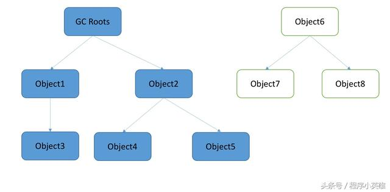

# 1、引用计数算法

给对象中添加一个引用计数器，每当有一个地方引用它时，计数器值就加1；当引用失效时，计数器值就减1；**任何时刻计数器为0的对象就是不可能在被使用的。**

客观的说，引用计数算法(Reference Counting)的实现简单，判定效率也很高，在大部分情况下它就是一个不错的算法。但是，至少主流的Java虚拟机里面没有选用引用计数算法来管理内存，其中最主要的原因是它很难解决对象之间相互循环引用的问题。举例如下：

```
public class ReferenceCountingGC{
    public Object instance = null;
    
    public static void testGC(){
        ReferenceCountingGC objA = new ReferenceCountingGC();
        ReferenceCountingGC objB = new ReferenceCountingGC();

        objA.instance = objB;
        objB.instance = objA;

        objA = null;
        objB = null;

        //假设在这行发生GC，objA和objB能否被回收？
        System.gc();
    }
}
```

如果按照引用计数算法来看，虽然引用objA和objB都已经置为null，但是两个对象的instance属性相互循环引用，则计数值均为1，不应该被GC回收掉，但其实这两个实例对象已经没用了。

JVM为了避免产生这种情况，采用了另外一种算法，使得循环引用可以被GC回收。

# 2、可达性分析算法

这个算法的基本思路就是通过一系列的称为"GC Roots"的对象作为起始点，从这些节点开始向下搜索，搜索所走过的路径称为引用链(Reference Chain),当一个对象到GC Roots没有任何引用链相连(从GC Roots到这个对象不可达)时，则证明此对象是不可用的，会被判定为可回收对象。如下图：

 

上图中，虽然Object7以及Object8被Object6引用，但是由于他们到GC Roots不可达，因此将会被GC回收。

在Java语言中，可作为GC Roots的对象包括以下几种：

+ 本地变量表中引用的对象
+ 方法区中类静态属性引用的对象
+ 方法区中常量引用的对象
+ 本地方法栈中JNI(即一般说的Native方法)引用的对象

**GC管理的主要区域是Java堆，一般情况下只针对堆进行垃圾回收。方法区、栈和本地方法区不被GC所管理,因而选择这些区域内的对象作为GC roots,被GC roots引用的对象不被GC回收。** 

# 3、被判定为可回收对象就一定会被回收吗？

即使在可达性分析算法中不可达的对象,也并非是“非死不可”的,这时候它们**暂时处于“缓刑”阶段,要真正宣告一个对象死亡,至少要经历两次标记过程**:如果对象在进行可达性分析后发现没有与GC Roots相连接的引用链,那它将会被第一次标记并且进行一次筛选,**筛选的条件是此对象是否有必要执行finalize()方法。当对象没有覆盖finalize()方法,或者finalize()方法已经被虚拟机调用过,虚拟机将这两种情况都视为“没有必要执行”。(即意味着直接回收)**

如果这个对象被判定为有必要执行finalize()方法,那么**这个对象将会放置在一个叫做F-Queue的队列之中,并在稍后由一个由虚拟机自动建立的、低优先级的Finalizer线程去执行它**.这里所谓的“执行”是指虚拟机会触发这个方法,但并不承诺会等待它运行结束,这样做的原因是,如果一个对象在finalize()方法中执行缓慢,或者发生了死循环(更极端的情况),将很可能会导致F-Queue队列中其他对象永久处于等待,甚至导致整个内存回收系统崩溃。

**finalize()方法是对象逃脱死亡命运的最后一次机会,稍后GC将对F-Queue中的对象进行第二次小规模的标记,如果对象要在finalize()中成功拯救自己——只要重新与引用链上的任何一个对象建立关联即可**,譬如把自己(this关键字)赋值给某个类变量或者对象的成员变量,那在第二次标记时它将被移除出“即将回收”的集合;**如果对象这时候还没有逃脱,那基本上它就真的被回收了。**

代码示例: 

```
public class FinalizeEscapeGC {  
    public static FinalizeEscapeGC SAVE_HOOK = null;  
  
    public void isAlive() {  
        System.out.println("yes,i am still alive:)");  
    }  
  
    @Override  
    protected void finalize() throws Throwable {  
        super.finalize();  
        System.out.println("finalize mehtod executed!");  
        FinalizeEscapeGC.SAVE_HOOK = this;  
    }  
  
    public static void main(String[] args) throws Throwable {  
        SAVE_HOOK = new FinalizeEscapeGC();  
        // 对象第一次成功拯救自己  
        SAVE_HOOK = null;  
        System.gc();  
        // 因为finalize方法优先级很低,所以暂停0.5秒以等待它  
        Thread.sleep(500);  
        if (SAVE_HOOK != null) {  
            SAVE_HOOK.isAlive();  
        } else {  
            System.out.println("no,i am dead:(");  
        }  
        // 下面这段代码与上面的完全相同,但是这次自救却失败了  
        SAVE_HOOK = null;  
        System.gc();  
        // 因为finalize方法优先级很低,所以暂停0.5秒以等待它  
        Thread.sleep(500);  
        if (SAVE_HOOK != null) {  
            SAVE_HOOK.isAlive();  
        } else {  
            System.out.println("no,i am dead:(");  
        }  
    }  
}  
  
运行结果:  
  
finalize mehtod executed!  
yes,i am still alive:)  
no,i am dead:(
```

SAVE_HOOK对象的finalize()方法确实被GC收集器触发过,并且在被收集前成功逃脱了。另外一个值得注意的地方是,代码中有两段完全一样的代码片段,执行结果却是一次逃脱成功,一次失败,这是因为**任何一个对象的finalize()方法都只会被系统自动调用一次,如果对象面临下一次回收,它的finalize()方法不会被再次执行,因此第二段代码的自救行动失败了**。因为finalize()方法已经被虚拟机调用过,虚拟机都视为“没有必要执行”。(即意味着直接回收) 