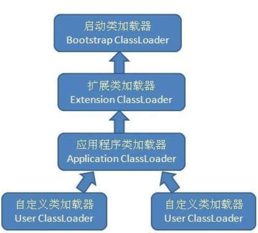

虚拟机设计团队把加载动作放到JVM外部实现，以便让应用程序决定如何获取所需的类，JVM提供了3种类加载器： 

- 启动类加载器(Bootstrap ClassLoader)：负责加载 JAVA_HOME\lib 目录中的，或通过-Xbootclasspath参数指定路径中的，且被虚拟机认可（按文件名识别，如rt.jar）的类。
- 扩展类加载器(Extension ClassLoader)：负责加载 JAVA_HOME\lib\ext 目录中的，或通过java.ext.dirs系统变量指定路径中的类库。
- 应用程序类加载器(Application ClassLoader)：负责加载用户路径（classpath）上的类库。

所谓的类加载器的双亲委派模型指的是类加载器之间的层次关系。该模型要求除了顶层的启动类加载器外，其余的类加载器都应该有自己的父类加载器，而这种父子关系一般通过组合关系来实现，而不是通过继承。如下图：

工作过程：如果一个类加载器收到了类加载的请求，他首先不会自己去尝试加载这个类，而是把这个请求委派给父类加载器去完成，每一个层次的类加载器都是如此，因此所有的加载请求最终都应该传送到顶层的启动类加载器中，只有当父类加载器反馈自己无法完成这个加载请求(他的搜索范围中没有找到所需的类)时，子加载器才会尝试自己去加载。

采用双亲委派的一个好处是比如加载位于rt.jar包中的类java.lang.Object，不管是哪个加载器加载这个类，最终都是委托给顶层的启动类加载器进行加载，这样就保证了使用不同的类加载器最终得到的都是同样一个Object对象。 