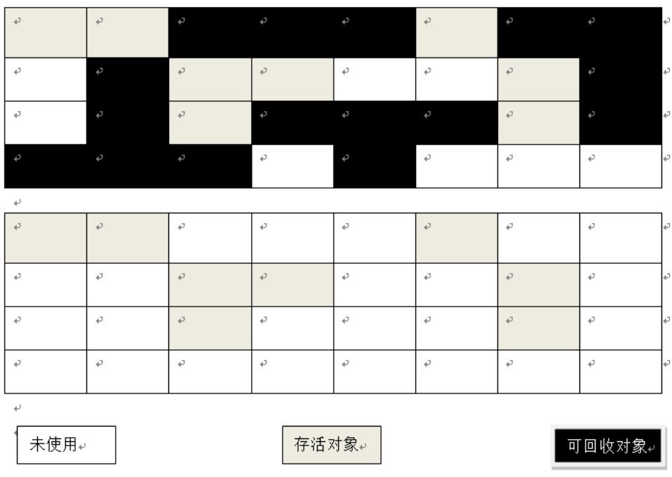
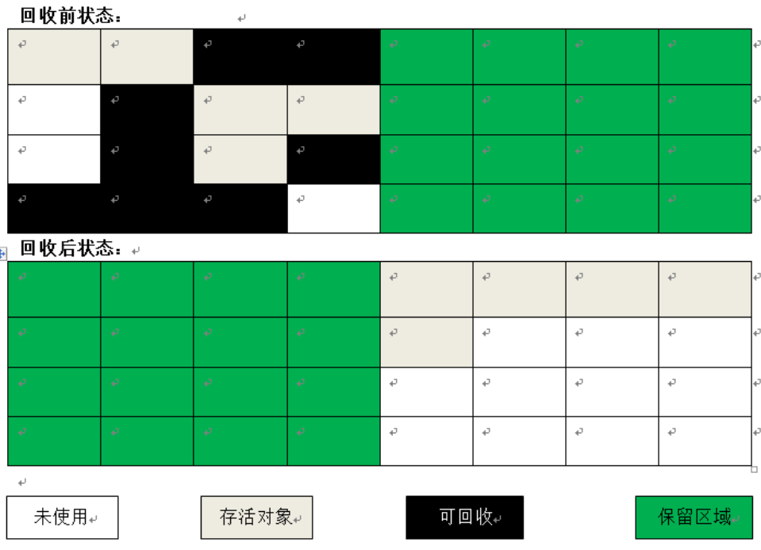
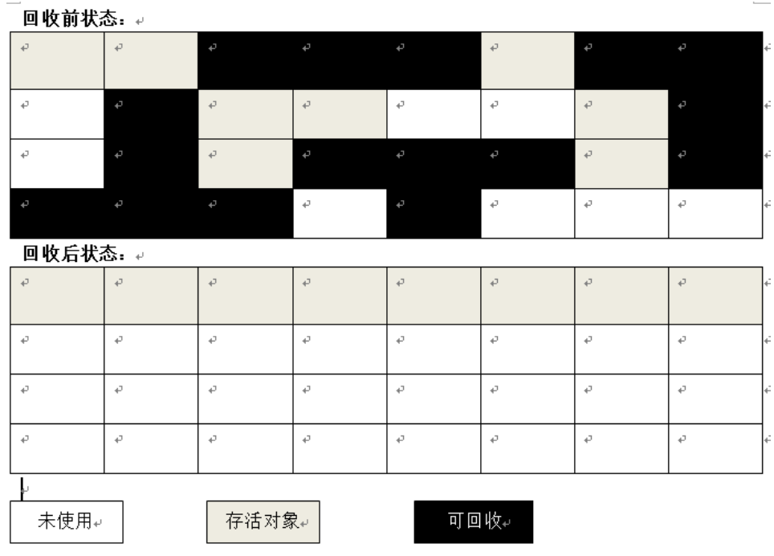

# 1、标记 -清除算法(Mark-Sweep)

首先标记出所有需要回收的对象，在标记完成后统一回收所有被标记的对象。

缺点：

* 标记和清除两个过程的效率都不高
* 标记清除之后会产生大量不连续的内存碎片，空间碎片太多可能会导致以后在程序运行过程中需要分配较大对象时，无法找到足够的连续内存而不得不提前触发另一次垃圾收集动作。

#2、复制算法(Copying)

将内存划分为大小相等的两块，每次只使用其中的一块，当这块内存用完了，就将还存活的对象复制到另一块内存上，然后把已使用过的内存空间一次清理掉。

优点：每次只对其中一块进行GC，不用考虑内存碎片的问题，并且实现简单，运行高效

缺点：内存缩小了一半

现在的商业虚拟机都采用这种收集算法来回收新生代。将内存分为一块较大的Eden空间和两块较小的Survivor空间，每次使用Eden和其中一块Survivor。当回收时，将Eden和Survivor中还存活着的对象一次性地复制到另外一块Survivor空间上，最后清理掉Eden和刚才用过的Survivor空间。HotSpot虚拟机默认Eden和Survivor的大小比例是8:1，也就是每次新生代中可用内存空间为整个新生代容量的90%(80%+10%)。但是我们没有办法保证每次回收都只有不多于10%的对象存货，当Survivor空间不够用时，需要依赖其他内存(这里指老年代)进行[分配担保](./空间分配担保.md)。

# 3、标记-整理算法(**Mark-Compact**)

复制收集对象在对象存活率较高时就要进行较多的复制操作，效率将会变低。更关键的是，如果不想浪费50%的空间，就需要有额外的空间进行分配担保，以应对被使用的内存中所有对象都100%存货的极端情况，所以在老年代一般不能直接选用这种算法。

标记-整理算法的标记过程仍然与"标记-清除"算法一样，但后续步骤不是直接对可回收对象进行清理，而是让所有存活的对象都向一端移动，然后直接清理掉端边界以外的内存。

# 4、分代收集算法(**Generational Collection** )

当前商业虚拟机的垃圾收集都采用"分代收集算法"。

根据对象的存活周期的不同将内存划分为几块，一本就分为**新生代和老年代**，根据各个年代的特点采用不同的收集算法。新生代(少量存活)用复制算法，老年代(对象存活率高)"标记-清理"或者"标记-整理"算法