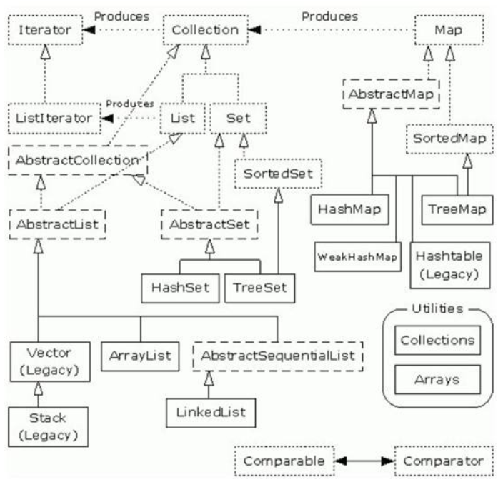

* 线程安全性

Vector：线程安全

ArrayList、LinkedList：非线程安全

* 实现方式

LinkedList：双向链表

ArrayList、Vector：数组


ArrayList和Vector是采用**数组方式存储数据**,此数组元素数大于实际存储的数据以便增加插入元素，都允许直接序号索引元素，但是插入数据要涉及到数组元素移动等内存操作，所以插入数据慢，查找有下标，所以查询数据快**,Vector由于使用了synchronized方法，线程安全，所以性能上比ArrayList要差**;LinkedList使用双向链表实现存储，按序号索引数据需要进行向前或向后遍历，但是插入数据时只需要记录本项前后项即可，插入数据较快。

线性表、链表、哈希表是常用的数据结构，在进行Java开发时，JDK已经为我们提供了一系列相应的类实现基本的数据结构，这些结构均在java.util包中



# Collection接口

Collection是最基本的集合接口，一个Collection代表一组Object，即Collection的元素（elements），一些Collection允许相同的元素存在，另一些不行。一些能排序，另一些不行。Java SDK不提供直接继承自Collection的类，Java SDK提供的类都是继承自Collection的子接口，如List和Set。

所有实现Collection接口的类都必须提供两个标准的构造函数：无参数的构造函数用于创建一个空的Collection，有一个Collection参数的构造函数用于创建一个新的Collection，这个新的Collection与传入的Collection有相同的元素，后一个构造函数允许用户复制一个Collection。

如何遍历Collection中的每一个元素？不论Collection的实际类型如何，他都支持一个iterator（）的方法，该方法返回一个迭代子，使用该迭代子即可逐一访问Collection中每一个元素。典型的用法如下：

```
Iterator it = clooection.iterator();//获得一个迭代子
while(it.hasNext()){
    Object obj = it.next();//得到下一个元素
}
```

由Collection派生两个接口：List以及Set：

## List接口

List是有序的Collection，使用此接口能够精确的控制每个元素插入的位置。**用户能够使用索引（元素在List中的位置，类似于数组下标）来访问List中的元素**，类似于Java数组。

List允许有相同的元素。除了具有Collection接口必备的iterator（）方法以外，List还提供一个listIterator（）方法，返回一个ListIterator接口，和标准的Iterator接口相比，ListIterator多了一些add（）之类的方法，允许添加，删除，设定元素，还能向前或向后遍历。

实现List接口的常用类有**LinkedList，ArrayList，Vector和Stack**。

### ArrayList类

ArrayList类实现了可变大小的数组，它允许所有元素，包括null。ArrayList没有同步（unsynchronized）。

每个ArrayList实例都有一个容量（Capacity），即用于存储元素的数组的大小。这个容量可随着不断添加新元素而自动增加，但是增长算法并没有定义。当需要插入大量元素时，在插入前可以调用ensureCapacity方法来增加ArrayList的容量以提高插入效率。

### Vector类

Vector非常类似ArrayList，但是Vector是同步的（synchronized）。由Vector创建的Iterator，虽然和ArrayList创建的Iterator是同一接口，但是，因为Vector是同步的，当一个Iterator被创建而且正在被使用，另一个线程改变了Vector的状态（例如，添加或删除了一些元素），这时调用Iterator的方法时将抛出ConcurrentModificationException，因此必须捕获该异常。

### Stack类

Stack类继承自Vector，实现一个后进先出的堆栈。Stack 提供五个额外的方法使得Vector得以被当做堆栈使用。基本的push和pop方法，还有peek方法得到栈顶的元素，empty方法测试堆栈是否为空，search方法检测一个元素在堆栈中的位置。Stack刚创建后是空栈。

## Map接口

Map并没有集成Collection接口，Map提供key到value的映射。一个Map中不能包含相同的key，每个key只能映射一个value。Map接口提供三种集合的视图，Map的内容可以被当作一组key集合，一组value集合，或者一组key-value映射。

### Hashtable类

Hashtable继承Map接口，实现一个key-value映射的哈希表。任何非空（non-null）的对象都可作为key或者value。

Hashtable通过initial capacity和load factor两个参数调整性能。通常缺省的load factor 0.75较好地实现了时间和空间的均衡。增大load factor可以节省空间但相应的查找时间将增大，这会影响像get和put这样的操作。

**Hashtable是同步的。**

### HashMap

HashMap和Hashtable类似，不同之处在于HashMap是**非同步**的，并且允许null，即null value和null key。但是将HashMap视为Collection时（value（）方法可返回Collection），其迭代子操作时间开销和HashMap的容量成正比。因此，如果迭代操作的性能相当重要，不要讲HashMap的初始化容量设得过高，或者load factor过低。

### WeakHashMap类

WeakHashMap是一种改进的HashMap，他对key实行“弱引用”，如果一个key不再被外部所引用，那么该key可以被gc回收

# 总结

如果涉及到堆栈，队列等操作，应该考虑用List，对于需要快速插入，删除元素，应该使用LinkedList，如果需要快速随机访问元素，应该使用ArrayList。

如果程序在单线程环境中，或者访问仅仅在一个线程中进行，考虑非同步的类，其效率高，如果多个线程可能同时操作一个类，应该使用同步的类。

要特别注意对哈希表的操作，作为key的对象要正确复写equals和hashCode方法。

尽量返回接口而非实际的类型，如返回List而非ArrayList，这样如果以后需要将ArrayList换成LinkedList时，客户端代码不用修改。这就是针对抽象编程