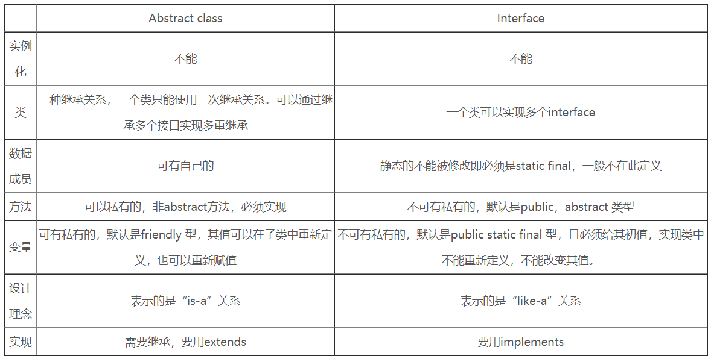

abstract class和interface都是用来进行抽象类定义的。

声明方法的存在而不去实现他的类被叫做抽象类（abstract class），它用于要创建一个体现某些基本行为的类，并为该类声明方法，但不能在该类中实现该类的情况。不能创建abstract类的实例。然而可以创建一个变量，其类型是一个抽象类，并让他指向具体子类的一个实例。不能有抽象构造函数或抽象静态方法。Abstract类的子类为他们父类中的所有抽象方法提供实现，否则他们也是抽象类。

接口（interface）是抽象类的变体。在接口中，所有方法都是抽象的。多继承性可通过实现这样的接口而获得。接口中的所有方法都是抽象的，没有一个有程序体。接口只可以定义static final成员变量。接口的实现与子类相似，除了该实现类不能从接口定义中继承行为。当类实现特殊接口时，他将会实现该接口的所有方法。然后，他可以在实现了该接口的类的对象上调用接口的方法。由于有抽象类，它允许使用接口名作为引用变量的类型。通常的动态联编将生效。引用可以转换到接口类型或从接口类型转换，instanceof运算符可以用来决定某对象的类是否实现了接口。

接口可以继承接口。抽象类可以实现接口，抽象类是可以继承实体类，但前提是实体类必须有明确地构造函数。

* 相同点
  1. 两者都不能实例化
  2. interface实现类以及abstract class的子类都必须要事先已经声明的抽象方法
* 不同点
  1. interface需要实现，要用implements，而abstract class需要继承，用extends
  2. 一个类可以实现多个interface，但一个类只能继承一个abstract class
  3. interface强调特定功能的实现，而abstract class强调所属关系
  4. 尽管interface实现类及abstract class的子类都必须要实现相应的抽象方法，但实现的形式不同。interface中的每一个方法都是抽象方法，都只是声明的，实现类必须要实现。而abstract class的子类可以有选择地实现。
     有选择地实现又分为两种：
     一是抽象类中的方法不一定都是抽象的。
     二是抽象类的子类在继承他时，对抽象方法可以选择实现，也可以通过再次声明其方法为抽象的方式，无需实现，留给其子类来实现，但此类也必须声明为抽象类。

## interface的应用场合

1. 类与类之间需要特定的接口进行协调，而不在乎其如何实现
2. 作为能够实现特定功能的标志存在，也可以是什么接口方法都没有的纯粹标志
3. 需要将一组类视为单一的类，而调用者只通过接口来与这组类发生联系
4. 需要实现特定的多项功能，而这些功能之间可能完全没有任何联系

# abstract的应用场合

1. 定义了一组接口，但又不想强迫每个实现类都必须实现所有的接口。可以用abstract class定义一组方法体，甚至可以是空方法体，然后由子类选择自己所感兴趣的方法来覆盖
2. 某些场合下，只靠纯粹的接口不能满足类与类之间的协调，还必需类中表示状态的变量来区别不同的关系。abstract的中介作用可以很好地满足这一点
3. 规范了一组相互协调的方法，其中一些方法是共同的，与状态无关的，可以共享的，无需子类分别实现；而另一些方法却需要各个子类根据自己特定的状态来实现特定的功能