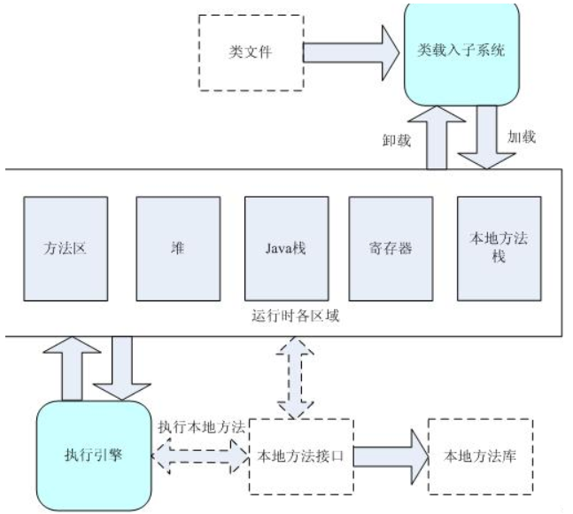
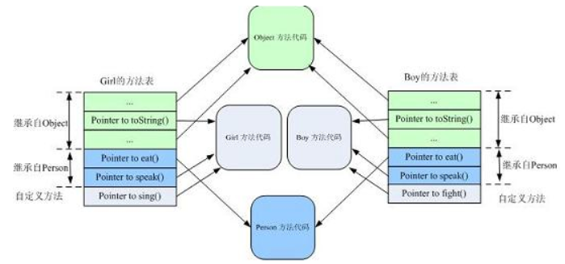
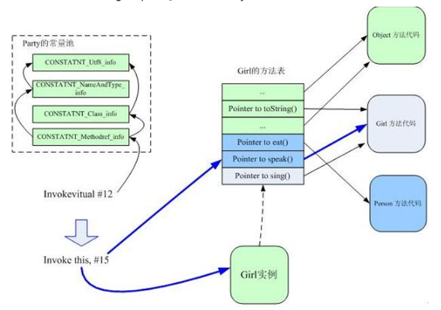
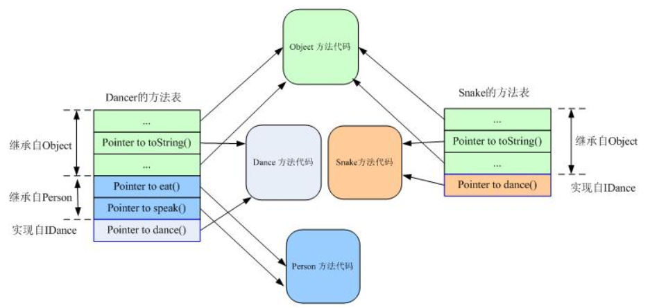

# Java多态概述

Java的方法重载，就是在类中可以创建多个方法，它们具有相同的名字，但可具有不同的参数列表、返回值类型。调用方法时通过传递的参数类型来决定具体使用那个方法，这就是多态性。

Java的方法重写，是父类与子类之间的多态性，子类可继承父类中的方法，但有时子类并不想原封不动地继承父类的方法，而是想作一定的修改，这就需要采用方法的重写。重写的参数列表和返回类型均不可修改。

* 方法重写后的动态绑定

  多态允许具体访问时实现方法的动态绑定。Java对于动态绑定的实现主要依赖于方法表，通过继承和接口的多态实现有所不同。

* 继承：在继承某个方法时，在方法区中找到该类的方法表，再确认该方法在方法表中的偏移量，找到该方法后如果被重写则直接调用，否则认为没有重写父类方法，这时会按照继承关系搜索父类的方法表中该偏移量对应的方法。

* 接口：Java允许一个类实现多个接口，从某种意义上来说相当于多继承，这样同一个接口的方法在不同类方法表中的位置就可能不一样。所以不能通过偏移量的方法，而是通过搜索完整的方法表。

# JVM的结构



从上图中可以看出，当程序运行需要某个类时，类加载器会将相应的class文件载入到JVM中，并在方法区建立该类的类型信息（包括方法代码、类变量、成员变量、以及方法表）

注意，这个方法区中的类型信息跟在堆中存放的class对象是不同的。在方法区中，这个class的类型信息只有唯一的实例（所以方法区是各个线程共享的区域），而在堆中可以有多个该class对象。可以通过堆中的class对象访问到方法区中类型信息。就像在Java反射机制那样，通过class对象可以访问到该类的所有信息。

**方法表是实现动态调用的核心，为了优化对象调用方法的速度，方法区的类型信息会增加一个指针，该指针指向记录该类方法的方法表，方法表中的每一个项都是对应方法的指针**。这些方法中包括从父类继承的所有方法以及自身重写的方法。

# Java的方法调用方式

Java的方法调用有两类，**动态方法调用**与**静态方法调用**。

静态方法调用是指对于类的静态方法的调用方式，是静态绑定的；而动态方法调用需要有方法调用所作用的对象，是动态绑定的。

类调用（invoke static）是在**编译时就已经确定好具体调用方法的情况**。

实例调用（invoke virtual）则是在**调用的时候才确定具体的调用方法**，这就是动态绑定，也是多态要解决的核心问题。

JVM的方法调用指令有四个，invoke static，invoke special，invoke virtual，invoke interface。前两个是静态绑定，后两个是动态绑定。

# 方法表与方法调用

如有类定义Person，Girl，Buy

```

class Person {
	public String toString(){
		return "I'm a person.";
	}
	
 	public void eat(){}
 	
 	public void speak(){}
}

class Boy extends Person{
     public String toString(){
        return "I'm a boy";
     }
     public void speak(){}
     
     public void fight(){}
}

class Girl extends Person{
     public String toString(){
        return "I'm a girl";
     }
     
     public void speak(){}
     
     public void sing(){} 
}  
```

当三个类被载入到JVM后，方法区中就包含了各自的类信息。Girl和Boy在方法区中的方法表可表示如下：



可以看到。Girl和Boy的方法表**包含继承自Object的方法，继承自直接父类Person的方法及各自新定义的方法**。注意方法表条目执行的具体的方法地址，如Girl继承自Object的方法中，只有toString（）指向自己的实现（Girl的方法代码），其余皆指向Object的方法代码；其继承自Person的方法eat（）和speak（）分别指向Person的方法实现和本身的实现。

**如果子类改写了父类的方法，那么子类和父类的那些同名的方法共享一个方法表项。**

因此，方法表的偏移量总是固定的。所有集成父类的子类的方法表中，其父类所定义的方法的偏移量也总是一个定值。

Person或Object中的任意一个方法，在他们的方法表和其子类Girl和Boy的方法表中的位置（index）是一样的。这样JVM在调用实例方法时只需要指定调用方法表中的第几个方法即可。

如调用如下：

```
class Party{
    void happyHour(){   
        Person girl = new Girl();   
        girl.speak();
    }   
} 
```

当编译Party类的时候，生成girl.speak（）的方法调用假设为：Invokevirtual#12

设该调用代码对应着girl.speak（）；#12是Party类的常量池的索引。JVM执行该调用指令的过程如下所示：



1. 在常量池（这里有个错误，上图为ClassReference常量池而非Party的常量池）中找到方法**调用的符号引用 。**
2. 查看Person的方法表，**得到speak方法在该方法表的偏移量**（假设为15），这样就得到该方法的直接引用。 
3. 根据this指针得到**具体的对象**（即 girl 所指向的位于堆中的对象）。
4. **根据对象得到该对象对应的方法表**,根据偏移量15查看有无重写（override）该方法，**如果重写，则可以直接调用（Girl的方法表的speak项指向自身的方法而非父类）；如果没有重写，则需要拿到按照继承关系从下往上的基类（这里是Person类）的方法表，同样按照这个偏移量15查看有无该方法。**


# 接口调用

因为 Java 类是可以同时实现多个接口的，而当用接口引用调用某个方法的时候，情况就有所不同了。Java 允许一个类实现多个接口，从某种意义上来说相当于多继承，这样**同样的方法在基类和派生类的方法表的位置就可能不一样了。**

```
interface IDance{
	void dance();
} 

class Person {
    public String toString(){
		return "I'm a person.";
	}
	
    public void eat(){}
     
    public void speak(){}
}

class Dancer extends Person implements IDance {
    public String toString(){
    	return "I'm a dancer.";
	}
      
	public void dance(){}
}

class Snake implements IDance{
	public String toString(){
		return "A snake."; 
	}
       
    public void dance(){
		//snake dance
	}
 } 
```



可以看到，由于接口的介入，**继承自接口 IDance 的方法 dance()在类 Dancer 和 Snake 的方法表中的位置已经不一样了**，显然我们无法仅根据偏移量来进行方法的调用。

**Java 对于接口方法的调用是采用搜索方法表的方式**,如，要在Dancer的方法表中找到dance()方法，必须搜索Dancer的整个方法表。

因为每次接口调用都要**搜索方法表**,所以从效率上来说，**接口方法的调用总是慢于类方法的调用的。**