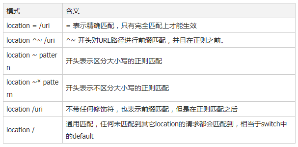

# URI匹配模式

location指令分为两种匹配模式

+ 普通字符串匹配：以=开头或开头无引导字符(~)的规则
+ 正则匹配：以~或~\*开头表示正则匹配，~\*表示正则不区分大小写

# location URI匹配规则

当nginx收到一个请求后，会截取请求的URI部分，去搜索所有的location指令中定义的URI匹配模式。在server模块中可以定义多个乐从安通指令来匹配不同的url请求，多个不同location配置的URI匹配模式。总体的匹配原则是：**先匹配普通字符串模式，再匹配正则模式**。只识别URI部分。

例如请求为：/test/abc/user.do?name=xxxx

当收到一个请求后，Nginx匹配这个请求的流程如下：

1. 先查找是否有=开头的**精确匹配**，如：location =/test/abc/user.do{...}
2. 再查找普通匹配，以**最大前缀**为原则，如，有一下两个location，则会匹配后一项
   + location /test/{...}
   + location /test/abc {...}
3. 匹配到一个普通格式后，搜索并未结束，而是暂存当前匹配结果，并继续搜索正则匹配模式
4. 所有正则匹配模式location中找到第一个匹配项后，就以此项为最终匹配结果。所以**正则匹配项匹配规则，受定义的前后顺序影响，但普通匹配模式不会**。
5. 如果未找到正则匹配项，则以第三步中缓存的结果为最终匹配结果
6. 如果一个匹配都没搜索到，返回404

# 语法规则

> location [=|~|~*|^~] /uri/ { … } 



多个location配置的情况下匹配顺序为：

+ 首先精确匹配 =
+ 其次前缀匹配 ^~
+ 其次是按文件中顺序的正则匹配
+ 然后匹配不带任何修饰的前缀匹配
+ 最后交给 / 通用匹配
+ 当有匹配成功，停止匹配，按当前匹配规则处理请求

例，有如下匹配规则：

```
location = / {
  echo "规则A";
}
location = /login {
  echo "规则B";
}
location^~ /static/ {
  echo "规则C";
}
location^~ /static/files {
  echo "规则X";
}
location ~ \.(gif|jpg|png|js|css)$ {
  echo "规则D";
}
location ~* \.png$ {
  echo "规则E";
}
location /img {
  echo "规则Y";
}
location / {
  echo "规则F";
}
```

访问结果如下：

1. 访问根目录` /` ，比如 `http://localhost/ `将匹配 规则A
2. 访问 `http://localhost/login `将匹配 规则B ，` http://localhost/register `则匹配 规则F
3. 访问` http://localhost/static/a.html `将匹配 规则C
4. 访问 `http://localhost/static/files/a.exe `将匹配 规则X ，虽然 规则C 也能匹配到，但因为最大匹配原则，最终选中了 规则X 。你可以测试下，去掉规则 X ，则当前 URL 会匹配上 规则C 。
5. 访问 `http://localhost/a.gif `, `http://localhost/b.jpg` 将匹配 规则D 和 规则 E ，但是 规则 D 顺序优先， 规则 E 不起作用，而 `http://localhost/static/c.png `则优先匹配到 规则 C
6. 访问` http://localhost/a.PNG `则匹配 规则 E ，而不会匹配 规则 D ，因为 规则 E 不区分大小写。
7. 访问` http://localhost/img/a.gif `会匹配上 规则D ,虽然 规则Y 也可以匹配上，但是因为正则匹配优先，而忽略了 规则Y 。
8. 访问 `http://localhost/img/a.tiff `会匹配上 规则Y 。
9. 访问` http://localhost/category/id/1111 `则最终匹配到规则 F ，因为以上规则都不匹配

