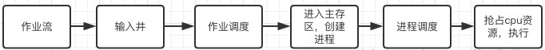

当作业流进入输入井的时候，首先会用作业调度来选择合适的作业进入主存区，这个合适的作业数量是根据允许并行作业的道数和作业调度的算法来决定的，此时，进入主存区的作业被操作系统创建了相应的进程，然后经过进程调度来进行占取cpu资源的操作，使得作业的执行。 

# 1.先来先服务算法(FCFS)

按进程（作业）进入就绪（后备）队列的先后次序来分配处理机（为其创建进程）。

一般采用非剥夺的调度方式。

FCFS 调度算法的平均作业周转时间与作业提交的顺序有关。 

**FCFS是非抢占式的，易于实现，效率不高，性能不好，有利于长作业（CPU繁忙性）而不利于短作业（I/O繁忙性）**。 

# 2.短作业优先调度算法(SJF)

从后备队列中选择一个或若干个估计运行时间最短的作业，将他们调入内存中运行。

## 优点

* 能有效降低作业的平均等待时间
* 能有效缩短进程的平均周转时间
* 提高吞吐量

## 缺点

* 对长作业不利
* 没有考虑作业的紧迫程度
* 作业执行时间、剩余时间仅为估计

# 优先级调度算法

优先级调度算法(Priority-Scheduling Algorithm, PSA)以作业的紧迫程度为优先级。

系统选择优先级最高的几个作业装入内存。

设定优先级会有两种方法，第一是用户自己设定，第二种是系统设定。系统设定会根据作业的类型，作业的等待时间，计算时间，作业的缓急程度等等各方面的因素来判断是否应该被服务，有些系统还能在输入井根据各方面因素来动态改变优先级。 

# 高响应比优先调度算法

高响应比优先调度算法(Highest Response Ratio Next,HRRN) 既考虑了作业的等待时间，也考虑了作业的运行时间，是一种动态优先级调度算法。 

周转时间：从提交到完成的时间间隔。

响应时间：在交互式系统中，从提交请求到产生首次响应的时间，而不是到产生输出结果所需的时间。 