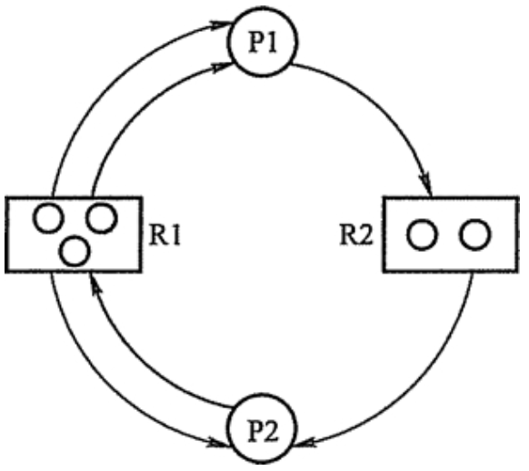
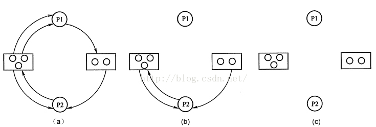

# 死锁的产生

计算机系统中有许多独占资源，他们在任一时刻只能被一个进程使用。一个进程需要使用独占型资源必须通过以下的次序：

* 申请资源
* 使用资源
* 归还资源

若申请时资源不可用，则申请进程等待。在许多应用中，一个进程需要独占访问不止一个资源，而操作系统允许多个进程并发执行共享系统资源时，此时可能会出现进程永远被阻塞的情况。例如：**两个进程分别等待对方占有的一个资源，于是两者都不能执行而永远处于等待。**这种现象称为“死锁”。

产生死锁的因素不仅与**系统拥有的资源数量**有关，而且与**资源分配策略，进程对资源的使用要求以及并发进程的推进顺序**有关。

出现死锁会造成很大的损失，因此，必须花费额外的代价来预防死锁的出现。可从三个方面来解决死锁问题。

* 死锁防止
* 死锁避免
* 死锁检测和恢复

# 死锁的防止

## 死锁产生的条件

系统产生死锁必定同时保持四个必要条件

* **互斥条件**：进程应互斥使用资源，任一时刻一个资源仅为一个进程独占，若另一个进程请求一个已被占用的资源时，他被置成等待状态，知道占有者释放资源。
* **占有和等待条件**：一个进程请求资源得不到满足而等待时，不释放已占有资源。
* **不剥夺条件**：任一进程不能从另一进程那里抢夺资源，即已被占用的资源，只能由占用进程自己释放。
* **循环等待条件**：存在一个循环等待链，其中，每一个进程分别等待它前一个进程所持有的资源，造成永远等待。

## 静态分配策略

所谓**静态分配**是指**一个进程必须在执行前就申请它所要的全部资源，并且直到它所要的资源都得到满足后才开始执行**。采用静态分配后，进程在执行中不再申请资源，因而，不会	出现占有了某些资源再等待一些资源的情况，即破坏了第二个条件（占有和等待条件）的出现。

静态分配策略实现简单，被许多操作系统采用。但这种策略严重降低了资源利用率，因为，在每个进程所占有的资源中，有些资源在进程较后的执行时间里才使用，甚至，有些资源在例外的情况下被使用。这样，就可能造成一个进程占有了一些几乎不用的资源而使其他想用这些资源的进程产生等待。

# 死锁的避免

破坏死锁的四个条件之一能防止系统发生死锁，但这会导致低效的进程运行和资源使用率。死锁的避免则相反，它允许系统中同时存在四个必要条件，如果能掌握并发进程中与每个进程有关的资源动态申请情况，作出明智和合理的选择，仍然可以避免死锁的发生。

每当在为申请者分配资源前先测试系统状态，若把资源分配给申请者会产生死锁的话，则拒绝分配，否则接受申请，为他分配资源。

## 银行家算法

银行家算法是一个避免死锁的著名算法，它以银行借贷系统的分配策略为基础，判断并保证系统的安全运行。

我们把操作系统看做是银行家，操作系统管理的资源相当于银行家管理的资金，进程向操作系统请求分配资源相当于用户向银行家贷款。

为保证资金安全，银行家规定：

* 当一个顾客对资金的最大需求量不超过银行家现有的资金时就可以接纳该顾客
* 顾客可以分期贷款，但贷款总数不能超过最大需求量
* 当银行家现有资金不能满足顾客所需的贷款数额时，对顾客的贷款可延迟支付，但总能使顾客在有限时间里得到贷款
* 当客户得到所需的全部资金后，一定能在有限时间里归还所有的资金

操作系统按照银行家指定的规则为进程分配资源，当进程首次申请资源时，要测试该进程对资源的最大需求量，如果系统现存资源可以满足他的最大需求量则按当前的申请量分配资源，否则就推迟分配。当进程在执行中继续申请资源时，先测试该进程本次申请资源数是否超过了该资源所剩余的总量。若超过则拒绝分配资源，若能满足咋按当前的申请量分配资源，否则也要推迟分配。

# 死锁的检测和接触

## 资源分配图

系统死锁，可以用资源分配图来描述。如下图，用圆圈代表一个进程，用框代表一类资源。由于一种类型的资源可能有多个，用框中的一个点代表一类资源中的一个资源。从进程到资源的有向边叫请求边，表示该进程申请一个单位的该类资源；从资源到进程的边叫分配边，表示该类资源已经有一个资源被分配给了该进程。

## 死锁定理

可以通过将资源分配图简化的方法来检测系统状态S是否为死锁状态。 方法如下：

1. 在资源分配图中，找出既不阻塞，又不是孤点的进程Pi（即找出一条有向边与他相连，且该有向边对应资源的申请数量小于等于系统中已有空闲资源数量。若所有的连接该进程的边均满足上述条件，则这个进程能继续运行直至完成，然后释放它所占有的所有资源）。消去他所有的请求边和分配边，使之成为孤立的节点。在图a中，P1是满足这一条件的进程节点，将P1的所有边消去，得到图b所示情况。
2. 进程Pi所释放的资源，可以唤醒某些因等待这些资源而阻塞的进程，原来的阻塞进程可能变成非阻塞进程。根据第一条的方法进行简化后，若能消去图中所有边，则称该图是可以完全简化的，如图c所示。

S为死锁的条件是当且仅当S状态的资源分配图是不可完全简化的,该条件为死锁定理。 

## 死锁的解除

一旦检测出死锁，就应立即采取相应的措施，以解除死锁，死锁解除的主要方法有：

1. 资源剥夺法：挂起某些死锁进程，并抢占它的资源，将这些资源分配给其他的死锁进程。但应防止被挂起的进程长时间得不到资源，而处于资源匮乏的状态。
2. 撤销进程法：强制撤销部分或者全部死锁进程并剥夺这些进程的资源。撤销的原则可以按照进程优先级和撤销进程代价的高低进行。
3. 进程回退法：让一个或多个进程回退到足以回避死锁的地步，进程回退时资源释放资源而不是被剥夺。要求系统保持进程的历史信息，设置还原点。