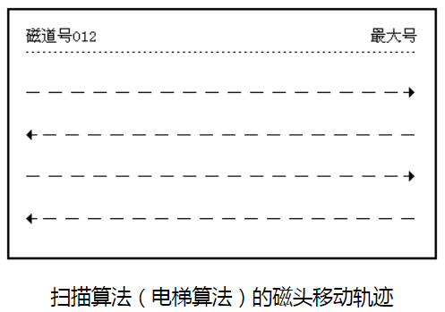

常见的磁盘调度算法有以下几种：

1. FIFO：先来先服务算法
2. SSTF：最短寻道时间算法
3. SCAN：电梯调度算法
4. CSCAN：循环扫描算法
5. FSCAN：分步电梯调度算法（分两个队列）

# 先来先服务算法

* 算法思想：按访问请求到达的**先后次序**服务
* 优点：简单，公平
* 缺点：效率不高，相邻两次请求可能会造成最内到最外的寻道，使磁头反复移动，增加服务时间，对机械也不利

例子：

假设磁盘访问序列：98，183，37，122，14，124，65，67。读写头起始位置：53。求：磁头服务序列和磁头移动总距离（道数）。

由题意和先来先服务算法的思想，得到下图所示的磁头移动轨迹。由此：

磁头服务序列为：98，183，37，122，14，124，65，67

磁头移动总距离=（98-53）+（183-98）+|37-183|+（122-37）+|14-122|+（124-14）+|65-124|+（67-65）=640（磁道）

# 最短寻道时间优先算法

* 算法思想：优先选择距当前磁头最近的访问请求进行服务，主要考虑寻道优先
* 优点：改善了磁盘平均服务时间
* 缺点：造成某些访问请求长期等待得不到服务

例子：

对上例的磁盘访问序列，磁头服务序列为：

53,65,67,37,14,98,122,124,183

# 扫描算法（电梯算法）

* 算法思想：当设备无访问请求时，磁头不动；当有访问请求时，磁头按一个方向移动，在移动过程中对遇到的访问请求进行服务，然后判断该方向上是否还有访问请求，如果有则继续扫描；否则改变移动方向，并为经过的访问请求服务，如此反复。如下图：

* 优点：克服了最短寻道优先的缺点，既考虑了距离，同时又考虑了方向

例子：

对上例的磁盘访问序列，磁头服务序列为：

53,37,14,65,67,98,122,124,183

# 循环扫描算法

算法思想：

> 1、总是从0号柱面开始向里扫描。 	
>
> 2、按照各自所要访问的柱面位置的次序去选择访问者。 
>
> 3、移动臂到达最后一个柱面后，立即带动读写磁头快速返回到0号柱面。 
>
> 4、返回时不为任何的等待访问者服务。 
>
> 5、返回后可再次进行扫描。 

