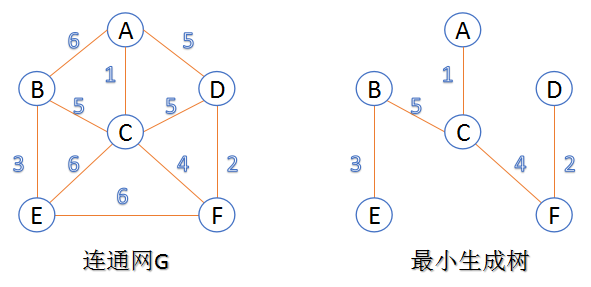
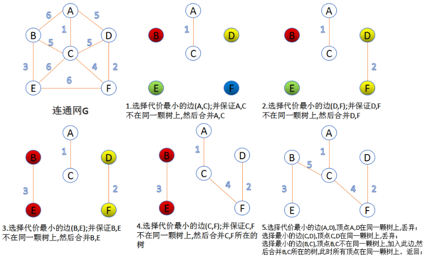
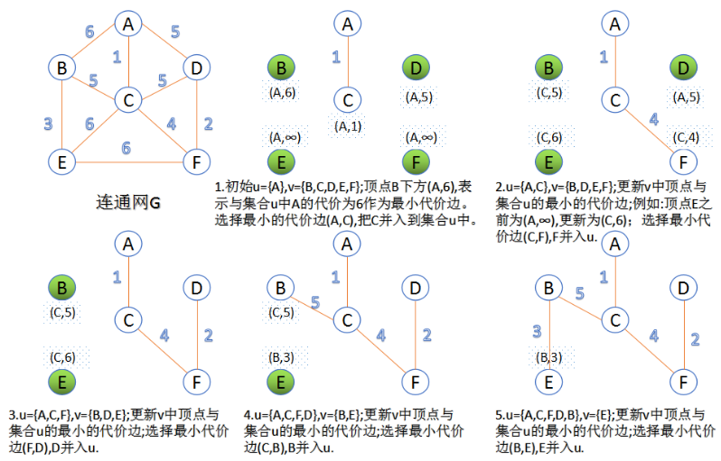

# 最小生成树

图的生成树是它的一颗含有所有顶点的无环连通子图，一幅加权图的最小生成树是它的一颗权值最小（树中所有边的权值之和）的生成树。

---

下面介绍两种求最小生成树算法

# 克鲁斯卡尔算法(Kruskal)

初始最小生成树边数为0，每迭代一次就选择一条满足条件的最小代价边，加入到最小生成树的边集合里。  

1. 把图中的所有边按代价从小到大排序
2. 把图中的n个顶点看成独立的n颗树组成的森林
3. 按权值从小到大选择边，所选的边连接的两个顶点***u~i~,v~i~***应属于两颗不同的树，则成为最小生成树的一条边，并将这两颗树合并作为一颗树。 
4. 重复第三步，直到所有顶点都在一棵树内或者有n-1条边为止

# 普里姆算法(Prim)

每次迭代选择代价最小的边对应的点，加入到最小生成树中。算法从某一个顶点s开始，逐渐长大覆盖整个连通网的所有顶点。 

1. 图的所有顶点集合为***V***；初始令集合***u={s},v=V−u***
2. 在两个集合***u,v***能够组成的边中，选择一条代价最小的边***(u~0~,v~0~)(u~0~,v~0~)***，加入到最小生成树中，并把***v~0~***并入到集合u中。
3. 重复上述步骤，直到最小生成树有n-1条边或者n个顶点为止。

