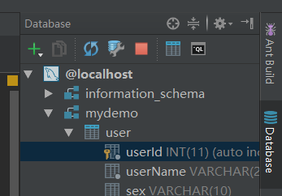
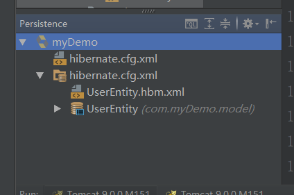
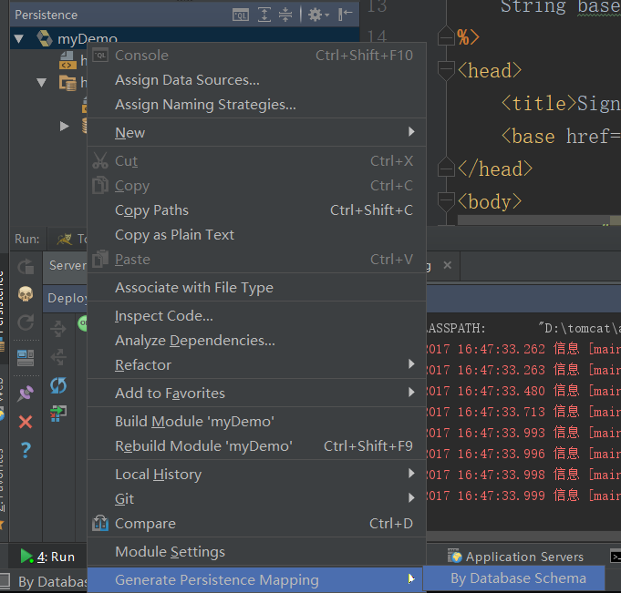
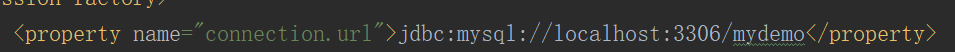
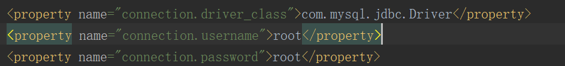
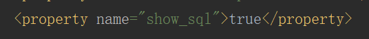
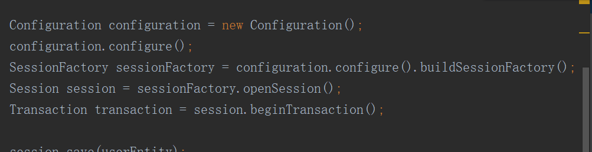
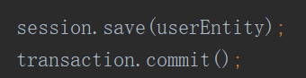

在IDEA中，通过右侧的Database完成与数据库的连接

然后在Persistence中完成数据库与model层中各实例的映射

而后，在hibernate.cfg.xml中完成对数据库的配置

其中，mydemo为所==连接的数据库名称==，若不添加数据库名称，则会报"database not select"错误

需要设立数据库的连接，如果数据库有密码，则需要进行设置。

此设置用于设定在执行时是否需要在控制台显示sql语句

在进行数据处理时，首先通过Configuration完成对cfg配置的读取，然后建立session工厂，并开始事务

在完成对数据的操作后，将事务提交并将session以及sessionFactory关闭