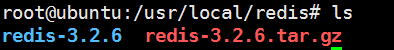
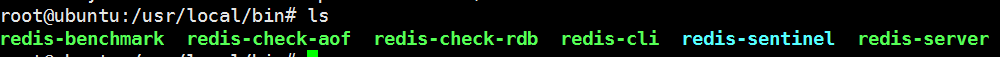
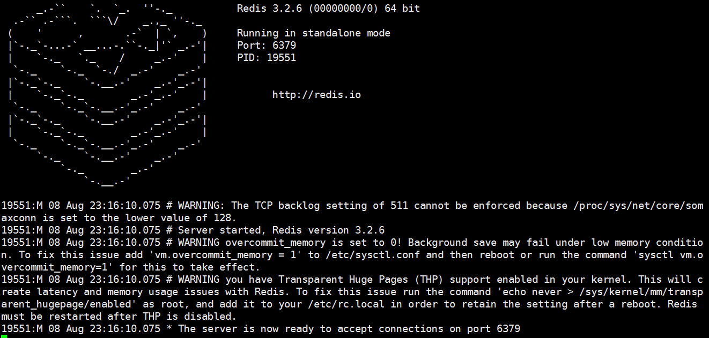
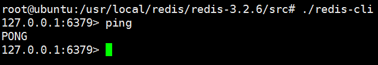

首先获取redis压缩包

> wget http://download.redis.io/releases/redis-3.2.6.tar.gz 

将压缩包解压



进入到redis-3.2.6目录 下，

```
make
make install
```

会将redis安装到/usr/local/bin目录下。



进入/usr/local/redis/redis-3.2.6/src目录下，分别在两个命令窗口中执行以下命令：

```
./redis-server ../redis.conf
./redis-cli
```

将会启动redis服务，并通过默认端口6379连接redis



在客户端输入ping，若输出为pong，则证明服务启动成功



以上，redis安装完成