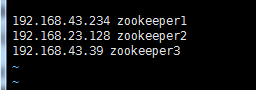
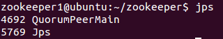
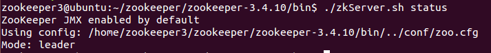
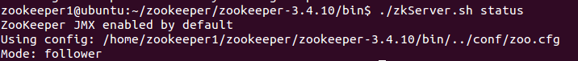

# 安装需求

安装**java**并完成各服务器之间的**ssh免密登录**

# 安装zookeeper

## 下载zookeeper

> wget http://apache.osuosl.org/zookeeper/zookeeper-3.4.3/zookeeper-3.4.3.tar.gz（本次安装3.4.3版本）
>
> 其他版本下载地址（最好使用stable版本）：http://zookeeper.apache.org/releases.html

## 解压

将安装包移到目标目录中并解压，本例中用/home/zookeeper1文件夹

`tar -zxvf zookeeper-3.4.3.tar.gz`

## 修改配置文件

首先将zookeeper-3.4.3/conf目录下的zoo_sample.cfg文件拷贝一份，命名为为“zoo.cfg”

然后修改zoo.cfg配置文件，修改内容为:

```
tickTime=2000

# The number of ticks that the initial 

# synchronization phase can take

initLimit=10

# The number of ticks that can pass between 

# sending a request and getting an acknowledgement

syncLimit=5

# the directory where the snapshot is stored.

# do not use /tmp for storage, /tmp here is just 

# example sakes.

dataDir=/home/zookeeper1/data

dataLogDir=/home/zookeeper1/logs

# the port at which the clients will connect

clientPort=2181

#

# Be sure to read the maintenance section of the 

# administrator guide before turning on autopurge.

#

# http://zookeeper.apache.org/doc/current/zookeeperAdmin.html#sc_maintenance

#

# The number of snapshots to retain in dataDir

#autopurge.snapRetainCount=3

# Purge task interval in hours

# Set to "0" to disable auto purge feature

#autopurge.purgeInterval=1

# 2888,3888 are election port

server.1=zookeeper1:2888:3888

server.2=zookeeper2:2888:3888

server.3=zookeeper3:2888:3888
```

其中，2888端口号是zookeeper服务之间通信的端口，而3888是zookeeper与其他应用程序通信的端口。而zookeeper1、2、3是在hosts中已映射了本机的ip。

>  修改/etc/hosts
>
> 

initLimit：这个配置项是用来配置 Zookeeper 接受客户端（这里所说的客户端不是用户连接 Zookeeper服务器的客户端，而是 Zookeeper 服务器集群中连接到 Leader 的 Follower 服务器）初始化连接时最长能忍受多少个心跳时间间隔数。当已经超过 10 个心跳的时间（也就是 tickTime）长度后 Zookeeper 服务器还没有收到客户端的返回信息，那么表明这个客户端连接失败。总的时间长度就是 5*2000=10 秒。

syncLimit：这个配置项标识 Leader 与 Follower 之间发送消息，请求和应答时间长度，最长不能超过多少个 tickTime 的时间长度，总的时间长度就是 2*2000=4 秒。

server.A=B：C：D：其中 A 是一个数字，表示这个是第几号服务器；B 是这个服务器的 ip 地址；C 表示的是这个服务器与集群中的 Leader 服务器交换信息的端口；D 表示的是万一集群中的 Leader 服务器挂了，需要一个端口来重新进行选举，选出一个新的 Leader，而这个端口就是用来执行选举时服务器相互通信的端口。如果是伪集群的配置方式，由于 B 都是一样，所以不同的 Zookeeper 实例通信端口号不能一样，所以要给它们分配不同的端口号。

## 创建dataDir以及dataLogDir

> 在/home/zookeeper1下建立data以及logs文件夹，并在data文件夹下建立myid文件
>
> touch myid
>
> 编辑myid文件，并在对应的机器上写入对应的编号。如在server.1对应的zookeeper1的myid文件中写入1，在server.2对应的zookeeper2的myid文件中写入2

## 配置路径

修改profile文件:

`sudo gedit /etc/profile`

> export ZOOKEEPER_HOME=/home/hadooptest/zookeeper-3.4.3
>
> PATH=$ZOOKEEPER_HOME/bin:$PATH
>
> export PATH

以上配置完成。

# 启动并测试zookeeper

在所有服务器中执行

`zookeeper-3.4.3/bin/zkServer.sh start`

输入jps命令查看进程：



查看状态：

`zookeeper-3.4.3/bin/zkServer.sh status`





启动客户端：

`zookeeper-3.4.3/bin/zkCli.sh`

停止zookeeper进程：

`zookeeper-3.4.3/bin/zkServer.sh stop`