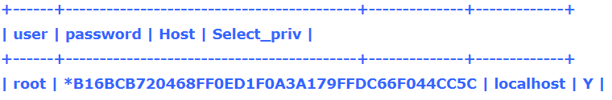
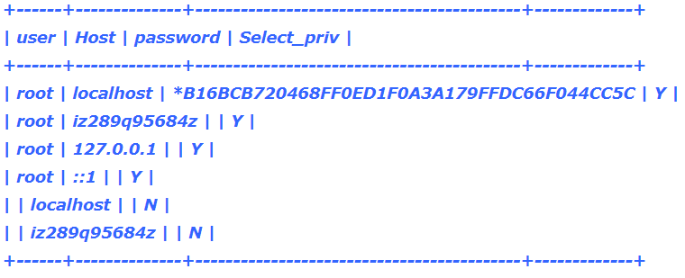
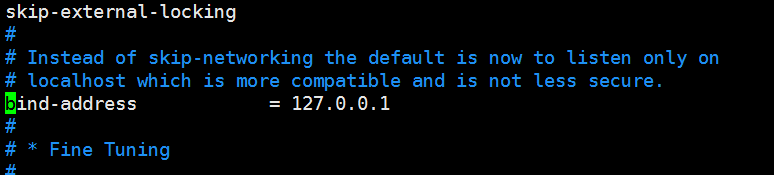

> 第一次在服务器上安装配置mysql，使用默认3306端口，本机Telnet没问题，但是使用别的服务器远程连接被拒绝，下面是解决方法

# 修改权限

基本每个mysql数据库都会有一个叫mysql的数据库，里面存放的是mysql的核心东西，其中user表里面	就要mysql连接的用户信息，里面字段有如下：

* host   (允许连接的主机，%代表全部主机可连接)
* user   (连接的用户名)
* password    (连接的密码，密码用mysql自带的password函数加密)
* select_priv     (是否允许查询，Y允许，N拒绝)
* alter_priv    (是否允许插入数据，Y允许，N拒绝)

剩下就是一堆权限，和select_priv的设置一样，其实组合起来就很容易理解了，处在host地址的用户user可以通过密码password访问数据库对应的权限

举个栗子：



IP地址在localhost的用户root通过password函数加密后访问数据库,并可以使用查询权限

远程服务器不能连接mysql就是因为在user表中没有记录，只要符合用户名(user)、密码(password)、主机地址(host)，就能访问数据库。

先瞅一眼数据库里的数据：

> mysql>select user,password,host,select_priv from user;



只要把第一条记录的host字段改成%就好了

```
update user  set Host = '%' where Host = 'localhost' & user = 'root'; 
flush privileges;
```

第一条命令修改允许访问的主机地址，第二条刷新权限。

# 取消本地绑定

mysql默认设置是绑定本地的，在修改完用户权限后，修改本地的mysql配置文件。

mysql的配置文件为my.cnf，如果找不到路径可以使用locate my.cnf查找。

在配置文件中找到bind-address一项，注释掉这一行再重启mysql就好了



