本篇完成对nginx直接访问mysql和redis的配置搭建

# nginx+redis+mysql的配置安装

nginx想要访问redis需要依赖lua脚本，我们可以直接使用一个整合了nginx和lua的框架，OpenResty。它由nginx核心加很多第三方模块组成，最大的亮点是默认集成了lua开发环境。

首先安装相关依赖包：

```
$ apt-get install libreadline-dev libncurses5-dev libpcre3-dev libssl-dev perl make build-essential
```

下载OpenResty：

连接mysql需要的drizzle建议我们使用ngx_openresty

```
wget http://openresty.org/download/ngx_openresty-1.7.7.2.tar.gz
```

安装drizzle

```
wget http://agentzh.org/misc/nginx/drizzle7-2011.07.21.tar.gz
cd drizzle7-2011.07.21/
./configure --without-server 
make libdrizzle-1.0
make install-libdrizzle-1.0

```

修改/etc/profile

```
export LIBDRIZZLE_INC=/usr/local/include/libdrizzle-1.0
export LIBDRIZZLE_LIB=/usr/local/lib
source /etc/profile
```

解压压缩文件，安装OpenResty

```
cd ngx_openresty-1.7.7.2/
./configure --prefix=/usr/local/openresty --with-luajit --with-http_drizzle_module
make
make install
```

之后进入/usr/local/openrestry/nginx/执行命令运行nginx

```
./sbin/nginx
```

但是此时报错

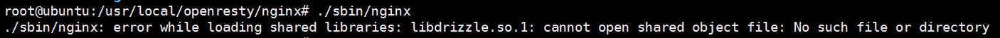

由于之前确认已经安装了drizzle，因此是没有读取到文件，添加软连接

```
$ ln -s /lib/libdrizzle.so.0.0.1 /lib/
```

再次启动nginx，没有报错，启动成功

此时，整个访问前的配置完成

# nginx+redis在nginx.conf中的配置

首先看一下nginx的配置

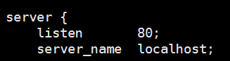

其中server块用于配置虚拟服务器，listen是监听端口，server_name用于匹配域名。server中的location块用于配置路径。

我们在刚才的server中建立一个location块

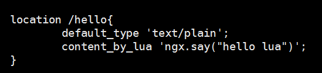

在上图中，将匹配路径http://localhost/hello，此处的location路径有多种匹配规则，此处不做介绍。以上的content_by_lua是lua脚本内容，如下：

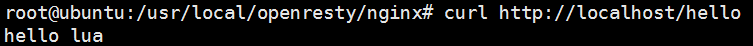

访问redis同样需要通过location块的配置

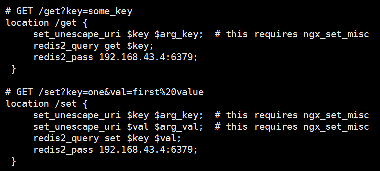

首先在redis中建立两条数据

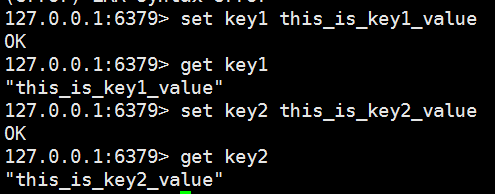

访问以上配置好的路径

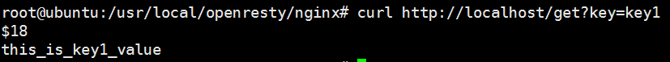

访问redis成功

# nginx+mysql在nginx.conf中的配置

在两个服务器中的mysql有两条数据

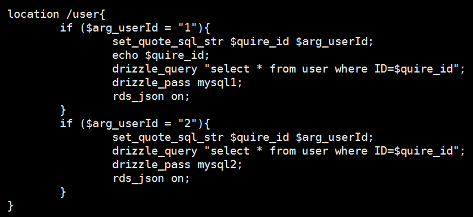

以上$arg_userId表示获取参数名为userId的值，mysql1表示指向配置好的upstream

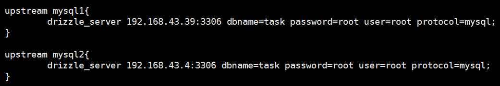

upstream用于负载均衡，一个upstream可以配置多个mysql服务器

访问以上配置好的路径

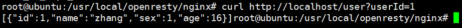

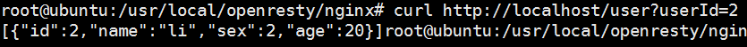

访问mysql成功。

# nginx+lua

在nginx中还可以处理lua脚本文件

在/usr/local/openresty/nginx/conf/文件夹中创建lua文件夹，在该文件夹中创建hello.lua文件并编辑

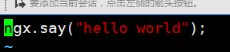

在nginx.conf文件中添加配置

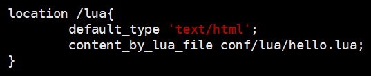

表示匹配/lua路径，执行刚才创建的hello.lua脚本文件

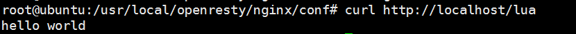

以上。