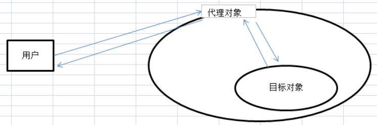

# 代理模式介绍

## 什么是代理模式

代理模式给某一个对象提供一个代理对象，并**由代理对象控制对原对象的引用，即通过代理对象访问目标对象**。这样做的好处是：**可以在目标对象实现的基础上，增强额外的功能操作，即扩展目标对象的功能**。

举个栗子来说明代理模式：假设我们想邀请一位明星，那么并不是直接连接明星，而是联系明星的经纪人，来达到同样的目的。明星就是一个目标对象，**他只要负责活动中的节目**，而其他琐碎的事情就交给它的代理人(经纪人)来解决。

用图表示如下：



代理模式的关键点是：代理对象与目标对象。代理对象是对目标对象的扩展，并会调用目标对象。

## 为什么要用代理模式

### 中介隔离作用

在某些情况下，一个客户类不想或者不能直接引用一个委托对象，而代理对象可以在客户类和委托对象之间起到**中介的作用**，其特征是**代理类和为拖累实现相同的接口**。

### 开闭原则，增加功能

代理类除了是客户类和为拖累的中介之外，我们还可以通过**给代理类增加额外的功能来扩展委托类的功能，这样做我们只需要修改代理类而不需要再修改委托类，符合代码设计的开闭原则**。代理类主要负责为委托类预处理消息、过滤信息、把消息转发给委托类，以及事后对返回结果的处理等。**代理类本身并不真正实现服务，而是通过调用委托类的相关方法，来提供特定的服务，真正的业务功能还是由委托类来实现，但是可以在业务功能执行的前后加入一些公共的服务**。例如我们想给项目加入缓存、日志这些功能，我们就可以使用代理类来完成，而没必要打开已经封装好的委托类。

# Java中的代理模式

我们有多种不同的方式来实现代理。如果按照代理创建的时期来进行分类，可分为两种：**静态代理、动态代理**。

静态代理是由程序员创建或特定工具自动生成源代码，再对其编译。在程序员运行之前，代理类class文件就已经被创建了。

动态代理是在程序运行时，通过**反射机制动态创建的**。

## 静态代理

静态代理在使用时，需要定义接口或者父类，被代理对象与代理对象一起实现相同的接口或者是继承相同父类。

### 第一步：创建服务类接口

```
package main.java.proxy;

public interface BuyHouse {
    void buyHosue();
}
```

### 第二步：实现服务接口

```
import main.java.proxy.BuyHouse;

public class BuyHouseImpl implements BuyHouse {

    @Override
    public void buyHosue() {
        System.out.println("我要买房");
    }
}
```

### 第三步：创建代理类

```
package main.java.proxy.impl;

import main.java.proxy.BuyHouse;

public class BuyHouseProxy implements BuyHouse {

    private BuyHouse buyHouse;

    public BuyHouseProxy(final BuyHouse buyHouse) {
        this.buyHouse = buyHouse;
    }

    @Override
    public void buyHosue() {
        System.out.println("买房前准备");
        buyHouse.buyHosue();
        System.out.println("买房后装修");

    }
}
```

### 测试类

```
import main.java.proxy.impl.BuyHouseImpl;
import main.java.proxy.impl.BuyHouseProxy;

public class ProxyTest {
    public static void main(String[] args) {
        BuyHouse buyHouse = new BuyHouseImpl();
        buyHouse.buyHosue();
        BuyHouseProxy buyHouseProxy = new BuyHouseProxy(buyHouse);
        buyHouseProxy.buyHosue();
    }
}
```

### 总结：

优点：

> 静态代理可以做到在不修改目标对象的功能前提下，对目标功能扩展，符合开闭原则

缺点：

> 每一个服务都需要我们创建代理类，工作量太大，不易管理。同时接口一旦发生改变，代理类也得相应修改。

## 动态代理

在动态代理中我们不再需要手动创建代理类，我们只需要编写一个动态处理器就可以了。真正的代理对象有JDK在运行时为我们动态的创建。

### 动态处理器

```
package main.java.proxy.impl;

import java.lang.reflect.InvocationHandler;
import java.lang.reflect.Method;

public class DynamicProxyHandler implements InvocationHandler {

    private Object object;

    public DynamicProxyHandler(final Object object) {
        this.object = object;
    }

    @Override
    public Object invoke(Object proxy, Method method, Object[] args) throws Throwable {
        System.out.println("买房前准备");
        Object result = method.invoke(object, args);
        System.out.println("买房后装修");
        return result;
    }
}
```

### 测试类

```
package main.java.proxy.test;

import main.java.proxy.BuyHouse;
import main.java.proxy.impl.BuyHouseImpl;
import main.java.proxy.impl.DynamicProxyHandler;

import java.lang.reflect.Proxy;

public class DynamicProxyTest {
    public static void main(String[] args) {
        BuyHouse buyHouse = new BuyHouseImpl();
        BuyHouse proxyBuyHouse =(BuyHouse)Proxy.newProxyInstance(BuyHouse.class.getClassLoader(), new Class[]{BuyHouse.class}, new DynamicProxyHandler(buyHouse));
        proxyBuyHouse.buyHosue();
    }
}
```

JDK实现代理只需要使用`newProxyInstance`方法,但是该方法需要接收三个参数：

* `ClassLoader loader `：指定当前目标对象使用的类加载器,获取加载器的方法是固定的 
* `Class<?>[] interfaces `：目标对象实现的接口的类型,使用泛型方式确认类型 
* `InvocationHandler h `：指定动态处理器,执行目标对象的方法时,会触发事件处理器的方法,会把当前执行目标对象的方法作为参数传入 

### 总结：

相对于静态代理，动态代理**大大减少了我们的开发任务，同时减少了对业务接口的依赖，降低了耦合度**。但是动态代理仅支持interface代理。动态生成的代理类已经有一个共同的父类Proxy。由于Java的继承机制注定了动态代理类无法实现对class的动态代理。

## Cglib代理

JDK实现动态代理需要实现类通过接口定义业务方法，对于没有接口的类，如何实现动态代理呢？这就需要Cglib了。Cglib采用了非常底层的字节码技术，其原理是**通过字节码技术为一个类创建子类，并在子类中采用方法拦截的技术拦截所有父类方法的调用，顺势织入横切逻辑**。但因为采用的是继承，所有不能对final修饰的类进行代理。

JDK动态代理与Cglib动态代理均是实现Spring AOP的基础。

### 创建Cglib代理类

```
package dan.proxy.impl;

import net.sf.cglib.proxy.Enhancer;
import net.sf.cglib.proxy.MethodInterceptor;
import net.sf.cglib.proxy.MethodProxy;

import java.lang.reflect.Method;

public class CglibProxy implements MethodInterceptor {
    private Object target;
    public Object getInstance(final Object target) {
        this.target = target;
        Enhancer enhancer = new Enhancer();
        enhancer.setSuperclass(this.target.getClass());
        enhancer.setCallback(this);
        return enhancer.create();
    }

    public Object intercept(Object object, Method method, Object[] args, MethodProxy methodProxy) throws Throwable {
        System.out.println("买房前准备");
        Object result = methodProxy.invoke(object, args);
        System.out.println("买房后装修");
        return result;
    }
}
```

### 测试类

```
package dan.proxy.test;

import dan.proxy.BuyHouse;
import dan.proxy.impl.BuyHouseImpl;
import dan.proxy.impl.CglibProxy;

public class CglibProxyTest {
    public static void main(String[] args){
        BuyHouse buyHouse = new BuyHouseImpl();
        CglibProxy cglibProxy = new CglibProxy();
        BuyHouseImpl buyHouseCglibProxy = (BuyHouseImpl) cglibProxy.getInstance(buyHouse);
        buyHouseCglibProxy.buyHosue();
    }
}
```

总结：Cglib创建的动态代理对象比JDK创建的动态代理对象的性能更高，但是Cglib创建代理对象时所花费的时间却比JDK多得多。所以对于单例的对象，因为无需频繁创建对象，用Cglib合适，反之使用JDK方式要更为合适。

在Spring AOP编程中，如果加入容器的目标对象有实现接口，用JDK代理。如果目标对象没有实现接口，用Cglib代理。