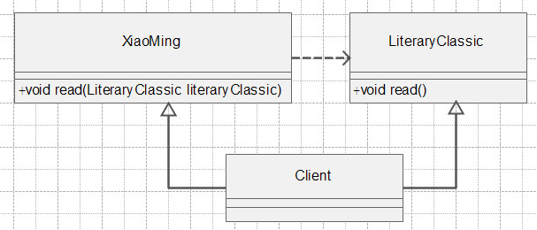
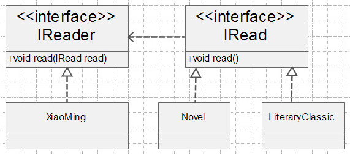

# 依赖倒置原则定义

* 高层模块不应该依赖底层模块，两者都应该依赖抽象
* 抽象不应该依赖细节
* 细节应该依赖抽象

**也可以说高层模块，底层模块，细节都应该依赖抽象**

依赖倒置原则在java语言中，表现是：

* 模块间的依赖通过抽象发生，实现类之间不发生直接的依赖关系，其依赖关系是通过接口或抽象类产生的
* 接口或抽象类不依赖实现类
* 实现类依赖接口或抽象类

# 依赖倒置原则介绍

小明同学阅读文学经典的一个类图 



文学经典的源代码 

```
//文学经典类
public class LiteraryClassic{
    //阅读文学经典
    public void read(){
       System.out.println("文学经典阅读，滋润自己的内心心灵");
    }
}
```

小明类 

```
//小明类
public class XiaoMing{
    //阅读文学经典
    public void read(LiteraryClassic literaryClassic){
        literaryClassic.read();
    }
}
```

场景类 

```
public class Client{
   public static void main(Strings[] args){
      XiaoMing xiaoming = new XiaoMing();
      LiteraryClassic literaryClassic = new LiteraryClassic();
      //小明阅读文学经典
      xiaoming.read(literaryClassic);
   }
}
```

小明同学看了一段文学经典后，忽然他想看看看小说来放松一下自己,我们实现一个小说类： 

```
//小说类
public class Novel{
    //阅读小说
    public void read(){
       System.out.println("阅读小说，放松自己");
    }
}
```

现在我们再来看代码，发现`XiaoMing`类的read方法只与文学经典`LiteraryClassic`类是强依赖，紧耦合关系，小明同学竟然阅读不了小说类。这与现实明显的是不符合的，代码设计的是有问题的。 

我们看小明类，此类是一个高层模块，并且是一个细节实现类，此类依赖的是一个文学经典`LiteraryClassic`类，而文学经典`LiteraryClassic`类也是一个细节实现类。这是不是就与我们说的依赖倒置原则相违背呢？依赖倒置原则是说我们的高层模块，实现类，细节类都应该是依赖与抽象，依赖与接口和抽象类。 

为了解决小明同学阅读小说的问题，我们根据依赖倒置原则抽象一个阅读者接口以及一个阅读接口

类图:

 

IReader接口:

```
public interface IReader{
   //阅读
   public void read(IRead read){
       read.read();
   }
}
```

被阅读的接口IRead 

```
public interface IRead{
   //被阅读
   public void read();
}
```

文学经典类:

```
//文学经典类
public class LiteraryClassic implements IRead{
    //阅读文学经典
    public void read(){
       System.out.println("文学经典阅读，滋润自己的内心心灵");
    }
}
```

小说类:

```
//小说类
public class Novel implements IRead{
    //阅读小说
    public void read(){
       System.out.println("阅读小说，放松自己");
    }
}
```

小明类:

```
//小明类
public class XiaoMing implements IReader{
    //阅读
    public void read(IRead read){
        read.read();
    }
}
```

然后，我们再让小明分别阅读文学经典和小说： 

```
public class Client{
   public static void main(Strings[] args){
      XiaoMing xiaoming = new XiaoMing();
      IRead literaryClassic = new LiteraryClassic();
      //小明阅读文学经典
      xiaoming.read(literaryClassic);

      IRead novel = new Novel();
      //小明阅读小说
      xiaoming.read(novel);
   }
}
```

接口就是进行方法和属性的声明，然后具体的业务逻辑是可以在实现接口的具体类中实现的。所以我们当依赖对象是接口时，就可以适应所有的实现此接口的具体类变化。 

# 依赖倒置的核心思想：面向接口编程

# 依赖倒置的核心思想：面向接口编程

# 依赖倒置的核心思想：面向接口编程