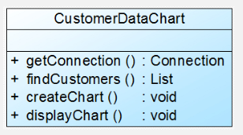
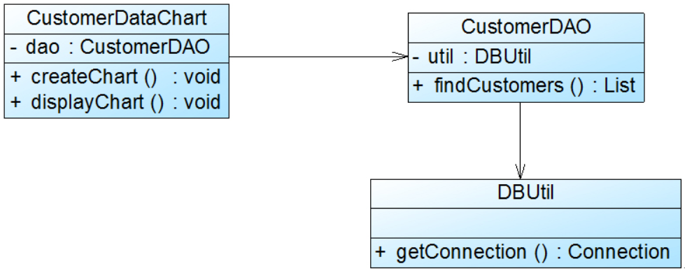

# 单一职责原则定义

一个类只负责一个功能领域中的相应职责，或者可以定义为：**就一个类而言，应该只有一个引起他变化的原因。**

# 单一职责原则介绍

在软件系统中，一个类承担的职责越多，他被复用的可能性就越小，而且一个类承担的职责过多，就相当于将这些职责耦合在一起，当其中一个职责变化时，可能会影响其他职责的运作，因此要将这些职责进行分离，将不同的职责封装在不同的类中，即将不同的变化原因封装在不同的类中，如果多个职责总是同时发生改变则可将他们封装在同一类中。

下面通过一个简单实例来进一步分析单一职责原则：

Sunny软件公司开发人员针对某CRM（Customer Relationship  Management，客户关系管理）系统中客户信息图形统计模块提出了如下图所示初始设计方案：

`CustomerDataChart`类中的方法说明如下：`getConnection()`方法用于连接数据库，`findCustomers()`用于查询所有的客户信息，`createChart()`用于创建图表，`displayChart()`用于显示图表。

在上图中，`CustomerDataChart`类承担了太多的职责，既包含与数据库相关的方法，又包含与图表生成和显示相关的方法。如果在其他类中也需要连接数据库或者使用`findCustomers()`方法查询客户信息，则难以实现代码的重用。无论是修改数据库连接方式还是修改图表显示方式都需要修改该类，它不止一个引起它变化的原因，违背了单一职责原则。因此需要对该类进行拆分，使其满足单一职责原则，类`CustomerDataChart`可拆分为如下三个类：

* DBUtil：负责连接数据库，包含数据库连接方法`getConnection()`
* CustomerDAO：负责操作数据库中的`Customer`表，包含对`Customer`表的增删改查等方法，如`findCustomers()`
* CustomerDataChart：负责图表的生成和显示，包含方法`createChart()`和`displayChart()`

 使用单一职责原则重构后的结构如下图所示：

# 单一职责原则优点

* 降低类的复杂度
* 提高类的可读性，提高系统的可维护性
* 降低变更引起的风险（降低对其他功能的影响）