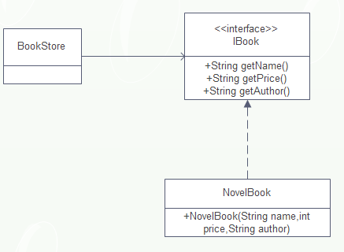
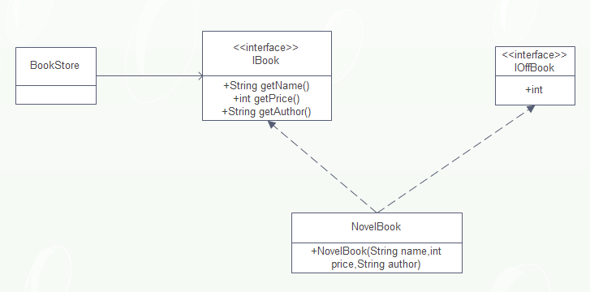

开闭原则的定义

**一个软件实体如类、模块和函数应该对扩展开放，对修改关闭**

# 开闭原则介绍

开闭原则明确地告诉我们，一个软件实体应该**通过扩展来实现变化**，而不是通过修改现有的代码来实现变化。

软件实体包括以下几个部分：

* 项目或软件产品中按照一定的逻辑规则划分的模块
* 抽象和类
* 方法

我们举例说明什么是开闭原则，以书店销售书籍为例，类图如下：



书籍接口：

```
public interface IBook{
    public String getName();
    public String getPrice();
    public String getAuthor();
}
```

小说类书籍:

```
public class NovelBook implements IBook{
    private String name;
    private int price;
    private String author;
    
    public NovelBook(String name, int price, String author){
        this.name = name;
        this.price = price;
        this.author = author;
    }

	@Override
    public String getName() {
        return name;
    }

	@Override
    public int getPrice() {
        return price;
    }

	@Override
    public String getAuthor() {
        return author;
    }
}
```

Client类：

```
public class Client{
    public static void main(String[] args){
        IBook novel = new NovelBook("笑傲江湖",100,"金庸");
        System.out.println("书籍名称："+novel.getName()+"书籍作者："+novel.getAuthor()+"书籍价格："+novel.getPrice)
    }
}
```

假如此时我们需要打折销售书籍，这是一个变化，我们要如何应对这一需求变化呢？

我们有如下三种方法可以解决此问题：

* 修改接口

  在`IBook`接口中，增加一个方法`getOffPrice()`，专门用于进行打折处理，所有的实现类实现此方法。但是这样的一个修改方式，实现类`NovelBook`要修改，同时**`IBook`接口应该是稳定且可靠，不应该经常发生改变，否则接口作为契约的作用就失去了**。因此，此方案否定。

* 修改实现类

  修改`NovelBook`类的方法，直接在`getPrice()`方法中实现打折处理。此方法是有问题的，例如我们如果`getPrice()`方法中只需要读取书籍的打折前的价格呢？当然我们也可以再增加`getOffPrice()`方法，这也是可以实现其需求，但是这就有两个读取价格的方法，因此该方案也不是一个最优方案。

* 通过扩展实现变化

  我们可以增加一个接口`IOffBook`，包含`getOffPrice`方法，由`NovelBook`类实现此方法修改少，对现有的代码没有影响，风险少，是个好办法。

下面是修改后的类图：



打折类：

```
public class NovelBook implements IBook,IOffBook{
	private String name;
	private int price;
	private String author;
    
	public NovelBook(String name, int price, String author){
        this.name = name;
        this.price = price;
        this.author = author;
	}

    @Override
    public String getName() {
    	return name;
    }

    @Override
    public int getPrice() {
    	return price;
    }

    @Override
    public String getAuthor() {
    	return author;
    }

    @Override
    public int getOffPrice(){
    	if(this.price > 40){
    		return this.price * 0.8;
    	}else{
    		return this.price * 0.9;
    	} 
    }
}
```

我们可以把变化归纳为两种类型：

* 逻辑变化

  只变化了一个逻辑，而不涉及其他模块，比如一个算法是a\*b\*c，现在需要修改为a+b+c，可以直接通过修改原有类中的方法的方式来完成，前提条件是所有依赖或关联类都按照相同的逻辑处理

* 子模块变化

  一个模块变化，会对其他的模块产生影响，特别是一个低层次的模块变化必然引起高层模块的变化，因此通过扩展完成变化。

# 为什么使用开闭原则

* **开闭原则是最基础的设计原则**，其他的五个设计原则都是开闭原则的具体形态，也就是说其他的五个设计原则是指导设计的工具和方法，而开闭原则才是其精神领袖，依照`java`语言的称谓，开闭原则是抽象类，而其他的五个原则是具体的实现类。

* 开闭原则可以提高复用性

  在面向对象的设计中，所有的逻辑都是从原子逻辑组合而来，不是在一个类中独立实现一个业务逻辑。只有这样的代码才可以复用，粒度越小，被复用的可能性越大。

* 开闭原则可以提高维护性

# 如何使用开闭原则

1. 抽象约束

   抽象是对一组事物的通用描述，没有具体的实现，也就表示他可以有非常多的可能性，可以跟随需求的变化而变化。因此，通过接口或抽象类可以约束一组可能变化的行为，并且能够实现对扩展开放，其包含三层含义：

   * 通过接口或抽象类约束扩散，对扩展进行边界限定，不允许出现在接口或抽象类中不存在的public方法
   * 参数类型，引用对象尽量使用接口或抽象类，而不是实现类，这主要是实现[里氏替换原则](里氏替换原则.md)的一个要求
   * 抽象层尽量保持稳定，一旦确定就不要修改

2. 元数据(metadata)控件模块行为

   尽量使用元数据来控制程序行为，减少重复开发。

   元数据是用来描述环境和数据的数据，通俗的说就是**配置参数**，参数可以从文件中获得，也可以从数据库中获得。

3. 制定项目章程

4. 封装变化

   对变化封装包含两层含义：

   * 将相同的变化封装到一个接口或抽象类中
   * 将不同的变化封装到不同的接口或抽象类中，不应该有两个不同的变化出现在同一个接口或抽象类中

   封装变化，也就是受保护的变化，找出预计有变化或不稳定的点，我们为这些变化点创建稳定的接口。