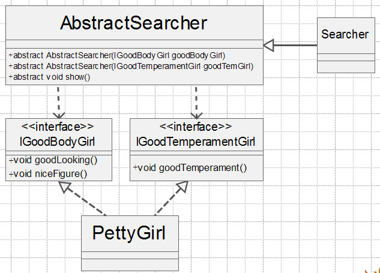

# 接口隔离原则定义

接口隔离有两种定义：

* 客户端不应该依赖它不需要的接口

  依赖它需要的接口，客户端需要什么接口就提供什么接口，把不需要的接口剔除，那就需要对接口进行细化，保证其纯洁性

* 类间的依赖关系应该建立在最小的接口上

  它要求是最小的接口，也是要求接口细化，接口纯洁

**建立单一接口，不要建立臃肿庞大的接口。接口尽量细化，同时接口中的方法尽量少**

# 接口隔离原则介绍

实现一个星探找美女的过程：

类图：


美女接口 ：IPrettyGirl

```
public interface IPettyGirl{
    //要有好的面孔
    public void goodLooking();
    //要有好身材
    public void niceFigure();
    //要有好气质
    public void goodTemperament();
}
```

美女实现类： PettyGirl 

```
public class PettyGirl implements IPettyGirl{

   private String name;

   public PettyGirl(String name){
        this.name = name;
   }

   public void goodLooking(){
       System.out.println(name + "---有好的面孔");
   }

   public void niceFigure(){
       System.out.println(name + "---有好身材");
   }

   public void goodTemperament(){
       System.out.println(name + "---有好气质");
   }
}
```

抽象星探类： AbstractSearcher

```
public abstract class AbstractSearcher{
    protected IPettyGirl pettyGirl;
    public AbstractSearcher(IPettyGirl pettyGirl){
       this.pettyGirl=pettyGirl;
    }
    //显示美女信息
    public abstract void show();
}
```

星探具体实现类： Searcher

```
public class Searcher extends AbstractSearcher{
   public Searcher(IPettyGirl pettyGirl){
       super(pettyGirl);
   }
   //显示美女信息
   public void show(){
      System.out.println("----美女的信息如下：---");
      //显示好的面孔
      super.pettyGirl.goodLooking();
      //显示好身材
      super.pettyGirl.niceFigure();
      //显示好气质
      super.pettyGirl.goodTemperament();
   }
}
```

场景类 :

```
public class Client{
   public static void main(Strings[] args){
      //定义一个美女
      IPettyGirl xiaoHong = new PettyGirl("小红");
      AbstractSearcher searcher = new Searcher(xiaoHong );
      searcher.show();
   }
}
```

然而，随着时代变化，人们的审美观点都在变化，美女的定义也在变化。人们也会把面容一般，身材一般，但是脾气特别好的女孩定义为美女，如气质美女。但是，我们定义的美女接口中规定是美女要具备三个条件，气质美女不是我们定义的美女。这个问题怎么办呢？ 

这是因此接口`IPettyGirl`设计有缺陷，它过于庞大，容纳了一些可变的因素，根据接口隔离原则，也就是接口应该尽量细化。我们把接口`IPettyGirl`拆分为二个接口，一个是外形美的美女`IGoodBodyGirl`，另一个是气质美的美女`IGoodTemperamentGirl`。这样，我们把一个比较臃肿的接口拆分为二个专门的接口，灵活性提高了，可维护性也增加了。 

类图：



二种类型的美女定义： 

```
public interface IGoodBodyGirl{
    //要有好的面孔
    public void goodLooking();
    //要有好身材
    public void niceFigure();
}
```

```
public interface IGoodTemperamentGirl{
    //要有好气质
    public void goodTemperament();
}
```

这样，不同类型的美女只需要实现不同类型的接口，不需要实现不相关的方法

# 保证接口的纯洁性

* 接口尽量小

  这是接口隔离原则的核心定义，借口要尽量小，不要出现臃肿的接口，但是小也是有限度的，不能违背单一职责原则

* 接口要高内聚

  高内聚就是提高接口、类、模块的处理能力，减少对外的交互。具体到接口隔离原则就是要求在接口中尽量减少公布public方法，借口是对外的承诺，承诺越少对系统开发越有利，变更的风险就越少

* 接口设计是有限度的

  接口的设计粒度越小，系统越灵活。但是灵活的同时也带来了结构复杂，开发难度大，可维护性降低。所以接口设计要注意度。

---

接口隔离原则是对接口的定义，同时也是对类的定义，接口和类尽量使用原子接口或原子类来组装。我们在实践中可通过以下规则衡量：

* 一个接口只服务于一个子模块或业务逻辑
* 通过业务逻辑压缩接口中的public方法，接口要不断精简
* 已经被污染的接口，尽量去修改，若变更的风险较大，则采用适配器进行转化处理