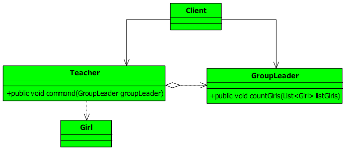
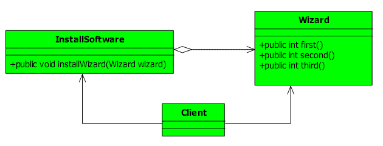

# 迪米特法则定义

一个对象应该对其他对象保持最少了解，简单来说就是**一个类对自己依赖的类知道的越少越好**。也就是说，对于被依赖的类来说，无论逻辑多么复杂，都尽量的将逻辑封装在类的内部，对外除了提供的public方法，不对外泄露任何信息。

迪米特法则还有一种解释：only talk to your immediate friends,即至于直接朋友通信。

首先来解释编程中的朋友：两个对象之间的**耦合关系**称之为朋友，通常有**依赖、关联、聚合和组成等**。而直接朋友通常变现为**关联、聚合和组成关系**，即两个对象之间联系更为紧密，通常以**成员变量、方法的参数和返回值**的形式出现。

# 迪米特法则介绍

迪米特法则包含以下四层意思：

## 一、只和朋友交流

举个栗子：在体育课上，老师要求体育委员清点一下女生人数。先看类图：



Teacher类 

```
public class Teacher { 
    //老师对学生发布命令,清一下女生 
    public void command(GroupLeader groupLeader){ 
        List<Girl> listGirls = new ArrayList(); 
        //初始化女生 
        for(int i=0;i<20;i++){ 
        	listGirls.add(new Girl()); 
        } 

        //告诉体育委员开始执行清查任务 
        groupLeader.countGirls(listGirls); 
    } 
} 
```

体育委员 GroupLeader 类 :

```
public class GroupLeader { 
    //有清查女生的工作 
    public void countGirls(List<Girl> listGirls){ 
    	System.out.println("女生数量是："+listGirls.size()); 
    } 
} 
```

业务调用类 Client :

```
public class Client { 
    public static void main(String[] args) { 
        Teacher  teacher= new Teacher(); 

        //老师发布命令 
        teacher.command(new GroupLeader()); 
    } 
} 
```

运行的结果如下： 

```
女生数量是：20
```

我们来看一下这个程序有什么问题。Teacher类有一个朋友，GroupLeader类。(**出现在成员变量、方法的输入输出参数中的类被称为朋友类**)，迪米特法则说一个类只和朋友交流，但是command方法中与Girl类有了交流，声明了一个泛型为Girl的List数组。我们来修改一下：

GroupLeader 类 ：

```
public class GroupLeader { 
    //有清查女生的工作 
    public void countGirls(){ 
        List<Girl> listGirls = new ArrayList<Girl>(); 
        //初始化女生 
        for(int i=0;i<20;i++){ 
        	listGirls.add(new Girl()); 
        } 

        System.out.println("女生数量是："+listGirls.size()); 
    } 
} 
```

Teacher类 :

```
public class Teacher { 
    //老师对学生发布命令,清一下女生 
    public void commond(GroupLeader groupLeader){ 
        //告诉体育委员开始执行清查任务 
        groupLeader.countGirls(listGirls); 
    } 
} 
```

修改后避开了Teacher与Girl的交流，减少系统间的耦合

## 二、朋友间也是有距离的

Wizard：

```
public class Wizard { 
    private Random rand = new Random(System.currentTimeMillis()); 
    //第一步  
    public int first(){ 
        System.out.println("执行第一个方法..."); 
        return rand.nextInt(100); 
    } 

    //第二步 
    public int second(){ 
        System.out.println("执行第二个方法..."); 
        return rand.nextInt(100); 
    } 

    //第三个方法 
    public int third(){ 
        System.out.println("执行第三个方法..."); 
        return rand.nextInt(100); 
    } 
}
```

InstallSoftware:

```
public class InstallSoftware { 
    public void installWizard(Wizard wizard){ 
        int first = wizard.first();   
        //根据first返回的结果，看是否需要执行second 
        if(first>50){ 
        	int second = wizard.second(); 
            if(second>50){ 
                int third = wizard.third(); 
                if(third >50){ 
                    wizard.first(); 
                }  
            }  
    	} 
	} 
}
```

Client:

```
public class Client { 
    public static void main(String[] args) { 
        InstallSoftware invoker = new InstallSoftware(); 
        invoker.installWizard(new Wizard()); 
    } 
} 
```



Wizard 类把太多的方法暴露给 InstallSoftware类了，这样耦合关系就非常紧了，假如修改一个方法的返回值，本来是 int 的，现在修改为 boolean，就需要修改其他的类，这样的耦合是极度不合适的，**迪米特法则就要求类“小气”一点，尽量不要对外公布太多的public方法和非静态的public 变量，尽量内敛，多使用private,default、protected 等访问权限**。 

修改后的程序：

Wizard:

```
public class Wizard { 
    private Random rand = new Random(System.currentTimeMillis()); 
    //第一步 
    private int first(){ 
        System.out.println("执行第一个方法..."); 
        return rand.nextInt(100); 
    } 

    //第二步 
    private int second(){ 
        System.out.println("执行第二个方法..."); 
        return rand.nextInt(100); 
    } 

    //第三个方法 
    private int third(){ 
        System.out.println("执行第三个方法..."); 
        return rand.nextInt(100); 
    } 

    //软件安装过程   
    public void installWizard(){     
        int first = this.first();   
        //根据first返回的结果，看是否需要执行second 
        if(first>50){ 
            int second = this.second(); 
            if(second>50){ 
                int third = this.third(); 
                if(third >50){ 
                	this.first(); 
                }  
            }  
        } 
    } 
}
```

三个步骤的访问权限修改为 private，同时把 installeWizad移动的 Wizard 方法中，这样 Wizard 类就对外只公布了一个 public 方法，类的高内聚特定显示出来了 。

InstallSoftware :

```
public class InstallSoftware { 
    public void installWizard(Wizard wizard){ 
        //不废话，直接调用 
        wizard.installWizard(); 
    } 
} 
```

这样我们的程序就做到了弱耦合，一个类公布越多的 public属性或方法，修改的涉及面也就越大，也就是变更引起的风险就越大。因此为了保持朋友类间的距离，你需要做的是：减少 public 方法，多使用 private、default、protected等访问权限，减少非 static 的public 属性，如果成员变量或方法能加上 final 关键字就加上，不要让外部去改变它。 

## 三、是自己的就是自己的

在项目中有一些方法，放在本类中也可以，放在其他类中也没有错误，那怎么去衡量呢？你可以坚持这样一个原则：**如果一个方法放在本类中，即不增加类间关系，也对本类不产生负面影响，就放置在本类中**。 

## 四、谨慎使用Serializable

使用 RMI 的方式传递一个对象 VO ，这个对象就必须使用 Serializable接口，也就是把你的这个对象进行序列化，然后进行网络传输。突然有一天，客户端的VO 对象修改了一个属性的访问权限，从 private 变更为 public 了，如果服务器上没有做出响应的变更的话，就会报序列化失败。 