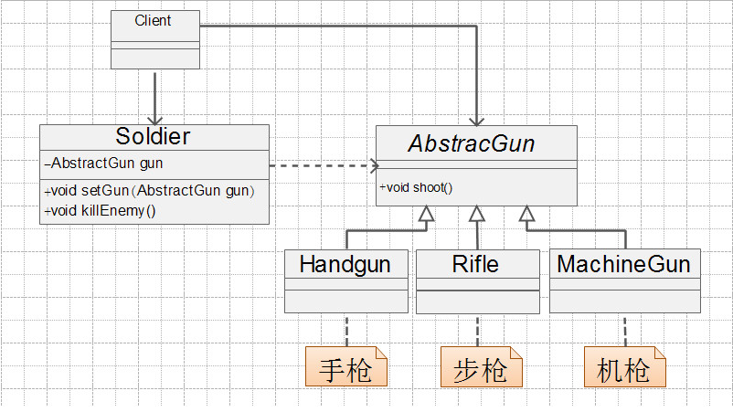
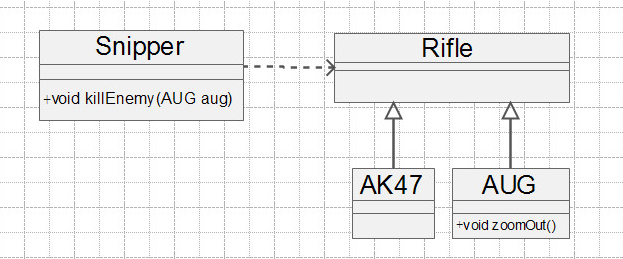

# 里氏替换原则定义

所有引用基类的地方必须能够透明的引用其子类的对象，即子类可以扩展父类的功能，但不能修改父类已有的功能。

也就是说在弗雷出现的地方子类也可以出现，并且替换为子类也不会报错，引用者根本不需要知道引用的是父类还是子类，但是反过来就行不通了，子类出现的地方父类就不一定能出现并代替子类。

# 里氏替换原则的特点

里氏替换原则为良好的集成定义了一个规范，主要要下面四个方面：

## 子类必须完全实现父类的方法

我们在做系统设计时，经常会定义一个接口或抽象类，然后编码实现，调用类则直接传入接口或抽象类，其实这已经使用了里氏替换原则。

举个射击的例子，其类图如下：



枪支抽象类：

```
public abstract class AbstractGun{
    //枪支射击的方法
    public abstract void shoot();
}
```

手枪、步枪、机枪的实现类：

```
public class Handgun extends AbstractGun{
    public void shoot(){
        System.out.println("手枪射击...");
    }
}
```

```
public class Rifle extends AbstractGun{
    public void shoot(){
        System.out.println("步枪射击...");
    }
}
```

```
public class CachineGun extends AbstractGun{
    public void shoot(){
        System.out.println("机枪射击...");
    }
}
```

士兵实现类：

```
public class Soldier{
    private AbstractGun gun;
    
    public void setGun(AbstractGun gun){
        this.gun = gun;
    }
    
    public void killEnemy(){
        System.out.println("士兵开始射击...");
        this.gun.shoot();
    }
}
```

场景类：

```
public class Client{
    public static void main(String[] args){
        Soldier soldier = new Soldier();
        
        //设置士兵手握手枪
        soldier.setGun(new Handgun());
        soldier.killEnemy();
        //设置士兵手握步枪
        soldier.setGun(new Rifle());
        soldier.killEnemy();
        //设置士兵手握机枪
        soldier.setGun(new CachineGun());
        soldier.killEnemy();
    }
}
```

注意：**如果子类不能完成的实现父类的方法，或者父类的一些方法在子类中已经发生畸变，则建议断开继承关系，采用依赖、聚合、组合等关系代替继承**。

## 子类可以有自己的个性

子类可以有自己的方法和属性。但是里氏替换原则可以正着用，不能反着用。在子类出现的地方，父类未必就可以胜任。还是以刚才枪支为例，在步枪中，有一些枪支比较有名，比如AK47，AUG狙击步枪等，我们把这两个型号的枪支引入后的类图如下：



AUG狙击步枪：

```
public class AUG extends Rifle {
	public void zoomOut(){
		System.out.println("通过放大镜观察");
	}

	public void shoot(){
		System.out.println("AUG射击...");
	}
}
```

狙击手类：

```
public class Snipper{
	public void killEnemy(AUG aug){
		aug.zoomOut();
		aug.shoot();
	}
}
```

场景类：

```
public class Client{
	public static void main(Strings[] args){
		Snipper snipper = new Snipper();
		snipper.killEnemy(new AUG());
	}
}
```

运行结果：

```
通过放大镜观察
AUG射击...
```

在这里，系统直接调用了子类，狙击手类是依赖枪支的，所以我拉直接把子类AUG传递进来，这个时候，我们可以把父类传递进来吗？修改一下Client类：

```
public class Client{
	public static void main(Strings[] args){
		Snipper snipper = new Snipper();
		snipper.killEnemy((AUG)(new Rifle()));
	}
}
```

调用程序，发现不行，会抛出异常(java.lang.ClassCastException)。这也就是大家经常说的向下转换是不安全的，从里氏替换原则来看，就是有子类出现的地方父类不一定能出现。

## 覆盖或实现父类的方法时输入参数可以被放大

方法中的输入参数称为前置条件，我们以一个例子说明一下覆盖或实现父类的方法时输入参数可以被放大：

我们先定义一个Father类：

```
import java.util.Collection;
import java.util.HashMap;

public class Father{
	public Collection doSomething(HashMap map){
		System.out.println("父类被执行");
		return map.values();
	}
}
```

再定义一个子类：

```
import java.util.Collection;
import java.util.Map;

public class Son extends Father{
	public Collection doSomething(Map map){
		System.out.println("子类被执行");
		return map.values();
	}
}
```

场景类：

```
public class Client{
	public static void main(Strings[] args){
		//父类存在的地方，子类应该可以存在
		Father father = new Father();
		HashMap map = new HashMap();
		father.doSomething(map);
	}
}
```

运行结果：

```
父类被执行
```

根据里氏替换原则，父类出现的地方，子类也是可以出现的。我们把Client代码修改如下：

```
public class Client{
	public static void main(Strings[] args){
		//父类存在的地方，子类应该可以存在
		//Father father = new Father();
		Son father = new Son();
		HashMap map = new HashMap();
		father.doSomething(map);
	}
}
```

运行结果：

```
父类被执行
```

结果一样，父类的方法的输入参数是HashMap类型，子类的方法输入参数是Map类型，也就是说子类的输入参数类型范围扩大了，子类代替父类，子类的方法不被执行，这是正确的，如果你想让子类的方法运行，就必须覆写父类的方法。

如果，我们反过来，把父类的输入参数类型放大，子类的输入参数类型缩小，让子类的输入参数类型小于父类的输入参数类型，看看会出现什么情况？

父类前置条件较大：

```
import java.util.Collection;
import java.util.Map;

public class Father{
    public Collection doSomething(Map map){
        System.out.println("父类被执行");
        return map.values();
    }
}
```

子类的前置条件较小：

```
import java.util.Collection;
import java.util.HashMap;

public class Son extends Father{
    public Collection doSomething(HashMap map){
        System.out.println("子类被执行");
        return map.values();
    }
}
```

场景类：

```
public class Client{
    public static void main(Strings[] args){
        //父类存在的地方，子类应该可以存在
        Father father = new Father();
        HashMap map = new HashMap();
        father.doSomething(map);
    }
}
```

运行结果：

```
父类被执行
```

我们再把里氏替换原则引入，父类出现的地方子类也可以出现，我们修改一下Client类，看看有什么问题：

```
public class Client{
    public static void main(Strings[] args){
        //父类存在的地方，子类应该可以存在
        //Father father = new Father();
        Son father = new Son();
        HashMap map = new HashMap();
        father.doSomething(map);
    }
}
```

输出结果：

```
子类被执行
```

调用了子类，子类在没有覆写父类的方法的前提下，子类方法被执行了，这会引起业务逻辑混乱，因为在实际应用中父类一般是抽象类，子类是实现类，你传递一个这样的实现类就会歪曲了父类的意图，引起业务逻辑混乱，所以子类中方法的前置条件必须与超类中被覆写的方法的前置条件相同或更宽松。

## 覆盖或实现父类的方法时，输出结果可以被缩小

父类的一个方法的返回值是一个类型T，子类的相同方法的返回值为S，那么里氏替换原则就要求S必须小于等于T。

采用里氏替换原则的目的就是增强程序的健壮性，版本升级时也可以保持非常好的兼容性。即使增加子类，原有的子类还可以继续运行。在实际项目中，每个子类对应不同的业务含义，使用父类作为参数，传递不同的子类完成不同的业务逻辑，非常完美。